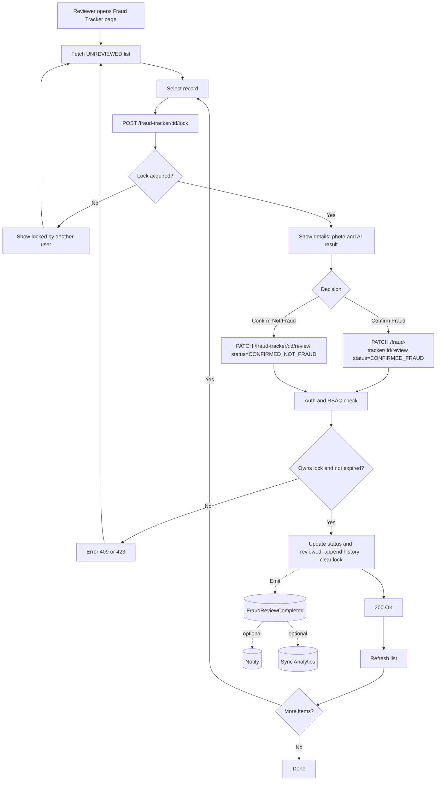

# Flow {DLSM} – Fraud Tracker Labeling

Context: Only for fraud detection tracker logs. Labeling is performed by Backoffice-X users; the tracker service remains read-only for others. Implementation lives in Backend Backoffice (NestJS), writing to the same Mongo collection used by the tracker.

## Proposed Status Model
- UNREVIEWED (default)
- CONFIRMED_FRAUD
- CONFIRMED_NOT_FRAUD

Optional future statuses can be added without breaking the API.

## Data Model Additions (Mongo)
- `status: 'UNREVIEWED' | 'CONFIRMED_FRAUD' | 'CONFIRMED_NOT_FRAUD'`
- `reviewed: { byUserId, byName, at, note? }` (only present when reviewed)
- `history: [{ type: 'LOCK'|'UNLOCK'|'REVIEW', at, actorId, actorName, from?, to?, note? }]` (append-only)
- `lock: { ownerUserId, ownerName, acquiredAt, expiresAt }` (soft lock; ephemeral)

Indexes:
- `{ status: 1, timestamp: -1 }` for listing/filtering.
- Optional: `{ timestamp: -1 }` if not present.

## API (Backend Backoffice)
- POST `/fraud-tracker/:id/lock` → acquire lock (409 if locked by someone else and not expired)
- DELETE `/fraud-tracker/:id/lock` → release lock (only by owner; idempotent)
- PATCH `/fraud-tracker/:id/review` → body: `{ status, note? }` (requires lock ownership; writes `status`, `reviewed`, appends `history`, clears `lock`)

RBAC: restrict to role `backoffice:fraud-reviewer` (and admins). JWT from Backoffice-X.

Migration: Backfill `status: 'UNREVIEWED'` where absent; create indexes.

Future hooks (non-blocking for now): emit domain event `FraudReviewCompleted` for notifications and analytics sync.

---

---

### Locking Implementation Notes
- Soft lock stored on document; acquire with conditional `findOneAndUpdate` filter ensuring missing/expired lock.
- Lock TTL recommendation: 10 minutes; UI can renew silently while detail view is open.
- Review endpoint requires caller to own the lock; on success, clears lock.

### Migration (Backfill) Notes
- Add `status: 'UNREVIEWED'` only for documents missing `status`.
- Create `{ status: 1, timestamp: -1 }` index.
- Idempotent migration: re-running should not alter already-reviewed docs.
