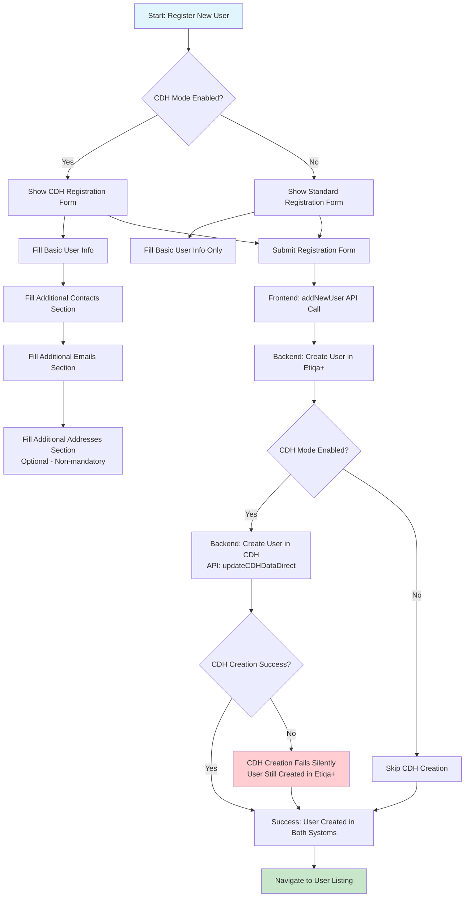
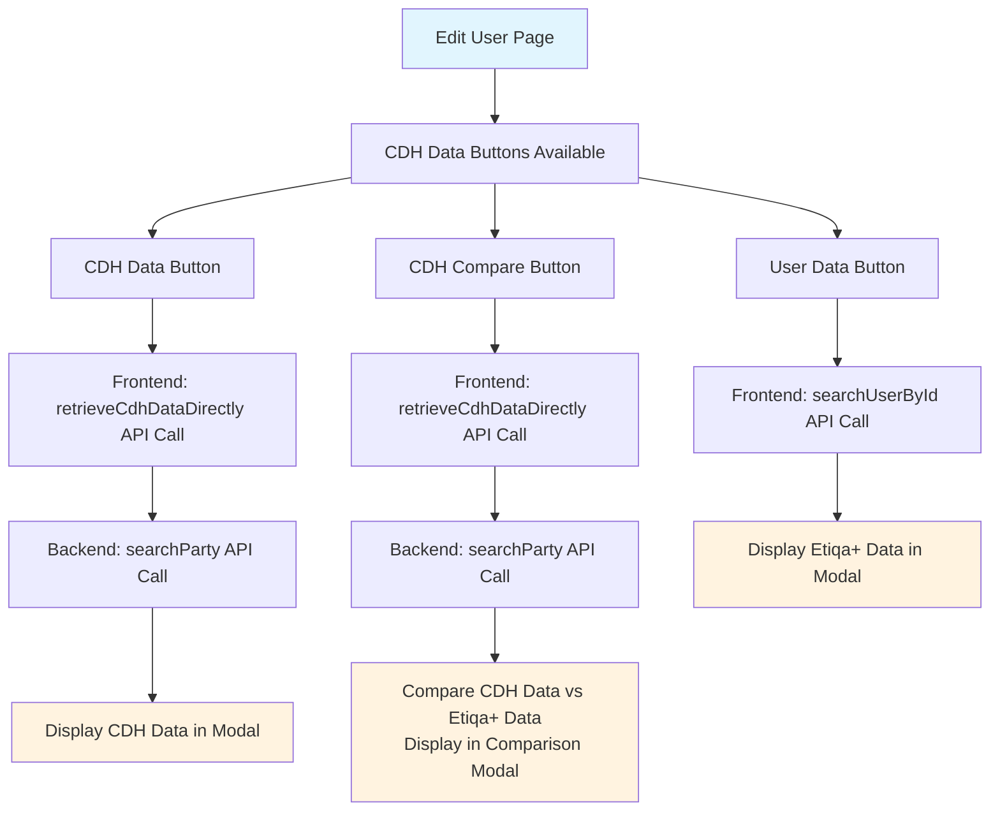
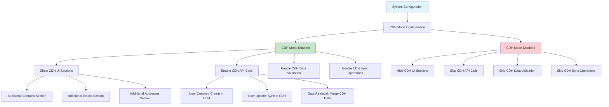

### The Big Picture

This is a user management system that works with two different databases:

1. Etiqa+ (the main system)

2. CDH (a separate customer data system)

Think of it like having two filing cabinets - one for your main records (Etiqa+) and another for customer data (CDH). This system helps keep both cabinets in sync.

### The Main Flows (Simplified)

#### 1. Creating a New User

- What happens: Admin fills out a form to create a new customer

- Behind the scenes:

- System saves the customer in the main database (Etiqa+)

- If CDH mode is "on", it also saves the customer in the CDH database

- If CDH is down or fails, the customer still gets created in the main system (no data loss)

#### 2. Editing an Existing User

- What happens: Admin clicks "edit" on a customer

- Behind the scenes:

- System pulls data from both databases and combines them

- Shows the admin a complete picture of the customer

- When admin saves changes, it updates both databases
# CDH Backoffice Feature Flowchart

  

## User Registration Flow

  



  

## User Edit Flow

```mermaid

flowchart TD

A[User Listing Page] --> B[Click Edit User]

B --> C[Navigate to Edit Page]

C --> D[Frontend: getSyncWithCdhUserDataById API Call]

D --> E[Backend: Check CDH Mode]

E --> F{CDH Mode Enabled?}

F -->|Yes| G[Backend: syncCdhIntoEplus API Call]

F -->|No| H[Backend: searchUserById API Call]

G --> I[Backend: Retrieve User from Etiqa+]

I --> J[Backend: Check if User Exists in CDH<br/>API: checkUserExistsInCdh]

J --> K[Backend: Retrieve CDH Data<br/>API: searchParty]

K --> L[Backend: Merge CDH Data with Etiqa+ Data<br/>Strategy: preferCdh = false<br/>Etiqa+ is Source of Truth]

L --> M[Backend: Return Merged Data]

H --> N[Backend: Return Etiqa+ Data Only]

M --> O[Frontend: Display Merged Data in Form]

N --> O

O --> P[User Edits Form Data]

P --> Q{CDH Mode Enabled?}

Q -->|Yes| R[Show CDH Sections:<br/>- Additional Contacts<br/>- Additional Emails<br/>- Additional Addresses]

Q -->|No| S[Hide CDH Sections]

R --> T[User Can Edit All Data]

S --> T

T --> U[Submit Form]

U --> V[Frontend: updateUserDetails API Call]

V --> W[Backend: Update User in Etiqa+]

W --> X{CDH Mode Enabled?}

X -->|Yes| Y[Backend: Sync Changes to CDH<br/>API: syncUserDataToCdh]

X -->|No| Z[Skip CDH Sync]

Y --> AA{CDH Sync Success?}

AA -->|Yes| BB[Success: User Updated in Both Systems]

AA -->|No| CC[CDH Sync Fails Silently<br/>User Still Updated in Etiqa+]

Z --> BB

CC --> BB

BB --> DD[Navigate Back to User Listing]

style A fill:#e1f5fe

style DD fill:#c8e6c9

style CC fill:#ffcdd2

```

  



  

## CDH Data Comparison Features

  



  

## Data Validation Rules

  

```mermaid

flowchart TD

A[Form Submission] --> B{CDH Mode Enabled?}

B -->|Yes| C[Validate CDH Sections]

B -->|No| D[Skip CDH Validation]

C --> E[Validate Contacts:<br/>- At least one contact required<br/>- Primary contact must be set]

C --> F[Validate Emails:<br/>- At least one email required<br/>- Primary email must be set]

C --> G[Validate Addresses:<br/>- Optional (non-mandatory)<br/>- If provided, validate format]

E --> H{Contacts Valid?}

F --> I{Emails Valid?}

G --> J{Addresses Valid?}

H -->|No| K[Show Error: Contacts Required]

I -->|No| L[Show Error: Emails Required]

J -->|No| M[Show Error: Invalid Address Format]

H -->|Yes| N[Proceed with Submission]

I -->|Yes| N

J -->|Yes| N

D --> N

K --> O[Stop Submission]

L --> O

M --> O

style A fill:#e1f5fe

style N fill:#c8e6c9

style O fill:#ffcdd2

```

  

## Configuration Management

  



  

## Notes and Concerns

  

### Business Logic

- **Source of Truth**: Etiqa+ is the primary source of truth (preferCdh = false)

- **Silent Failures**: CDH operations can fail silently without affecting user experience

- **Configuration**: CDH mode can be toggled via backend configuration

- **Data Merging**: CDH data fills gaps in Etiqa+ data but doesn't override existing data

  

### Technical Considerations

- **Error Handling**: CDH failures are logged but don't block user operations

- **Retry Logic**: Failed CDH operations may be retried automatically

- **Data Consistency**: Etiqa+ data takes precedence in conflicts

- **Performance**: CDH API calls may add latency to user operations

  

### Validation Rules

- **Contacts**: Required when CDH mode is enabled

- **Emails**: Required when CDH mode is enabled

- **Addresses**: Optional (non-mandatory) even when CDH mode is enabled

- **Basic Fields**: Always required regardless of CDH mode

  

### API Endpoints Used

- `GET /api/backoffice/portal-user/sync-cdh-into-eplus/:userId` - Sync CDH data into Etiqa+

- `POST /api/backoffice/portal-user` - Create new user

- `PUT /api/backoffice/portal-user/:userId` - Update user

- `GET /api/backoffice/portal-user/:userId` - Get user by ID

- CDH API endpoints for data retrieval and updates

  

## Questions and Answers

  

### Initial Clarification Questions

  

**Q1: User Registration Flow**

- **Question**: I see there are two registration forms - one with CDH sections (`page-cdh.tsx`) and one without (`page.tsx`). When you say "registering user" and "this will show the form we have created for CDH changes" - are you referring to the CDH-enabled registration form that includes the additional contacts, emails, and addresses sections?

- **Answer**: Yes.

  

**Q2: CDH User Creation**

- **Question**: In step 3, you mention "submit button actually calls to CDH to create a user". Looking at the code, I see the `addNewUser` function is called, but I don't see the direct CDH API call in the frontend. Is the CDH user creation happening in the backend when `addNewUser` is called?

- **Answer**: The API of CDH user creation is being called in the backend.

  

**Q3: Address Validation**

- **Question**: In step 6, you mention "when editing need to ensure that can submit without entering addresses. because address is non mandatory input." I can see in the code that addresses are handled in the `AddressesManager` component, but I want to confirm - are you saying that the form should allow submission even if the addresses array is empty?

- **Answer**: Yes.

  

**Q4: Data Flow**

- **Question**: When you say "the data loaded in the edit profile actually already merged with cdh data" - I can see that `getSyncWithCdhUserDataById` calls the `sync-cdh-into-eplus` API which merges CDH data. Is this correct?

- **Answer**: Yes.

  

**Q5: User Listing Navigation**

- **Question**: For step 4, when you click "edit" from the user listing, does this directly navigate to the edit page that calls `getSyncWithCdhUserDataById`?

- **Answer**: Yes.

  

### Detailed Technical Questions

  

**Q6: CDH Mode Configuration**

- **Question**: I see there's a `getCdhModeConfig()` call that determines whether CDH sections are shown. When CDH mode is disabled, does the form still work but without the additional contacts/emails/addresses sections, or does it completely hide the CDH functionality?

- **Answer**: It will hide the CDH functionality. and no sync to CDH should work.

  

**Q7: Data Synchronization Strategy**

- **Question**: You mentioned "Etiqa is source of truth" for merging. Looking at the code, I see `preferCdh: false` is used. Does this mean when editing, if there's a conflict between Etiqa+ data and CDH data, Etiqa+ data always wins?

- **Answer**: YES. and I can change that on the go.

  

**Q8: User Creation vs Update Flow**

- **Question**: For new user registration: Does the backend create the user in Etiqa+ first, then create them in CDH?

- **Answer**: Yes. it will create in Etiqa+ first then in CDH.

  

**Q9: User Update Flow**

- **Question**: For user updates: Does the backend update Etiqa+ first, then sync to CDH?

- **Answer**: Same goes to user update, it will update to Etiqa+ first, then sync to CDH.

  

**Q10: Error Handling**

- **Question**: What happens if CDH is down during user creation or editing?

- **Answer**: I'm not focusing on this. can put as concern in the notes. this is a good perspective. currently, the approach is to just retry. if it fails, it will fails silently.

  

**Q11: Validation Flow**

- **Question**: I see there are validation checks for contacts and emails when CDH mode is enabled. Are these validations only applied when CDH mode is enabled, during both creation and editing?

- **Answer**: Yes. applied only when CDH mode is enabled, during both creation and editing. but if an address is being added, related validation will occur.

  

**Q12: API Endpoints**

- **Question**: I see multiple CDH-related endpoints. For the flowchart, should I show the specific API calls or keep it at a higher level?

- **Answer**: Could you include both?

  

### Final Clarification Questions

  

**Q13: CDH Mode Toggle**

- **Question**: When CDH mode is disabled, does the system still store the CDH-related data fields (contacts, emails, addresses arrays) but just hide the UI sections, or completely ignore CDH data and only work with basic user fields?

- **Answer**: I intended to ignore completely if the CDH mode disabled.

  

**Q14: Address Validation Details**

- **Question**: When you say "if an address is being added, related validation will occur" - what specific validations are applied to addresses?

- **Answer**: Yes.

  

**Q15: Data Flow Sequence**

- **Question**: For the edit flow, I want to confirm the exact sequence: User clicks edit → calls `getSyncWithCdhUserDataById` → this calls `sync-cdh-into-eplus` API → merges CDH data with Etiqa+ data → displays merged data in form. Is this correct?

- **Answer**: YES!!

  

**Q16: CDH Data Display**

- **Question**: In the edit form, when CDH data is merged, does the UI show only the merged data (user can't see what came from CDH vs Etiqa+), or are there indicators showing which data came from which source?

- **Answer**: No indicator, but there is a button at the bottom of the form to show data from etiqa+, data from CDH, and also button to show comparisons of the data.

  

**Q17: Configuration Changes**

- **Question**: When you say "i can changes that on the go" for the source of truth configuration - does this mean the `preferCdh` setting can be changed via admin interface, or it's a backend configuration that requires deployment?

- **Answer**: The configuration can change through config.js. which is backend configuration.

  

**Q18: Silent Failures**

- **Question**: For the "fails silently" approach - does this mean the user operation (create/update) succeeds in Etiqa+ even if CDH sync fails, the user gets a success message even if CDH operations failed, and failed CDH operations are logged but don't affect the user experience?

- **Answer**: Yes.