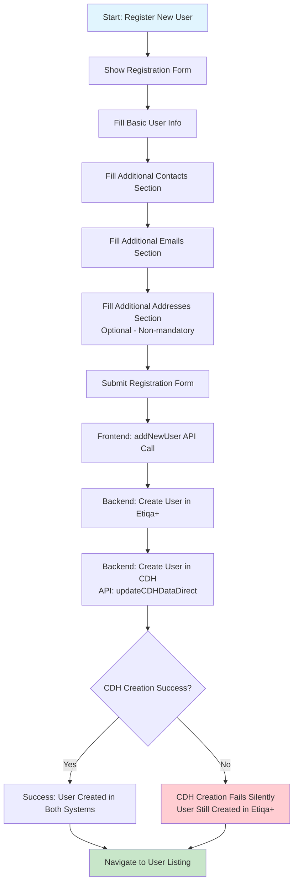
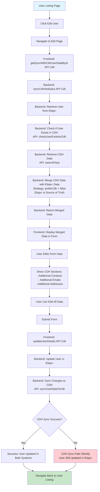
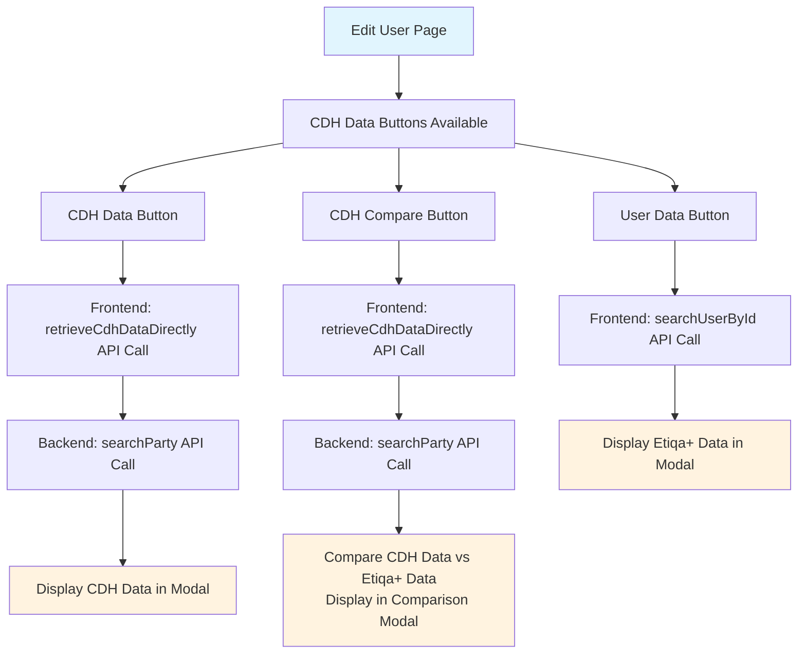
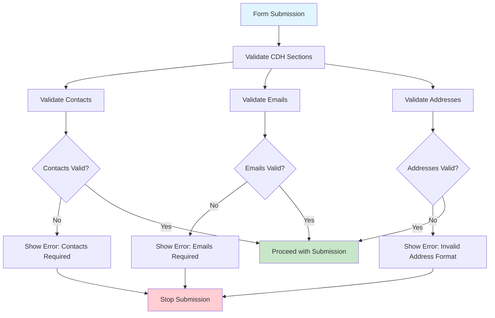
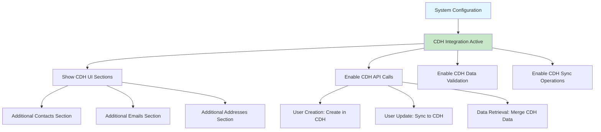

# CDH Backoffice Feature Flowchart

  

## Simplified User Registration Flow

  

  

## Simplified User Edit Flow

  

  

## CDH Data Comparison Features

  

  

## Simplified Data Validation Rules

  

  

## Core System Flow

  

  

## Key Implementation Details

  

### Core Business Rules

- **Data Priority**: We set Etiqa+ as the primary source of truth (preferCdh = false) to maintain data integrity

- **Graceful Degradation**: CDH operations fail silently to ensure the main system keeps working

- **Flexible Configuration**: CDH mode can be switched on/off through backend config for different environments

- **Smart Merging**: CDH data only fills missing information in Etiqa+, never overwrites existing data

  

### System Reliability Features

- **Non-blocking Operations**: CDH failures get logged but don't stop user workflows

- **Automatic Recovery**: Failed CDH operations retry automatically in the background

- **Conflict Resolution**: Etiqa+ data always wins when there are conflicts with CDH

- **Performance Impact**: CDH API calls add some delay but we optimize for reliability over speed

  

### Form Validation Strategy

- **Contact Requirements**: Must have at least one contact when CDH mode is active

- **Email Requirements**: Must have at least one email when CDH mode is active

- **Address Flexibility**: Addresses remain optional even with CDH mode enabled

- **Core Fields**: Basic user fields are always required regardless of CDH settings

  

### Backend API Structure

- `GET /api/backoffice/portal-user/sync-cdh-into-eplus/:userId` - Merges CDH data into Etiqa+ user

- `POST /api/backoffice/portal-user` - Creates new user in both systems

- `PUT /api/backoffice/portal-user/:userId` - Updates user and syncs to CDH

- `GET /api/backoffice/portal-user/:userId` - Retrieves user data

- Additional CDH API endpoints handle data retrieval and updates

  

## Development Discussion Notes

  

### Initial Requirements Clarification

  

**Q1: User Registration Flow**

- **My Understanding**: there are two registration forms - one with CDH sections (`page-cdh.tsx`) and one without (`page.tsx`). When you mentioned "registering user" and "this will show the form we have created for CDH changes" - I wanted to confirm you're referring to the CDH-enabled registration form that includes the additional contacts, emails, and addresses sections?

- **Your Confirmation**: Yes.

  

**Q2: CDH User Creation**

- **My Understanding**: In step 3, you mentioned "submit button actually calls to CDH to create a user". Looking at the code, I see the `addNewUser` function is called, but I don't see the direct CDH API call in the frontend. I wanted to clarify if the CDH user creation is happening in the backend when `addNewUser` is called?

- **Your Confirmation**: The API of CDH user creation is being called in the backend.

  

**Q3: Address Validation**

- **My Understanding**: In step 6, you mentioned "when editing need to ensure that can submit without entering addresses. because address is non mandatory input." I can see in the code that addresses are handled in the `AddressesManager` component, but I wanted to confirm - are you saying that the form should allow submission even if the addresses array is empty?

- **Your Confirmation**: Yes.

  

**Q4: Data Flow**

- **My Understanding**: When you mentioned "the data loaded in the edit profile actually already merged with cdh data" - I can see that `getSyncWithCdhUserDataById` calls the `sync-cdh-into-eplus` API which merges CDH data. I wanted to verify this understanding is correct?

- **Your Confirmation**: Yes.

  

**Q5: User Listing Navigation**

- **My Understanding**: For step 4, when you click "edit" from the user listing, does this directly navigate to the edit page that calls `getSyncWithCdhUserDataById`?

- **Your Confirmation**: Yes.

  

### Technical Implementation Details

  

**Q6: CDH Mode Configuration**

- **My Understanding**: I noticed there's a `getCdhModeConfig()` call that determines whether CDH sections are shown. I wanted to clarify - when CDH mode is disabled, does the form still work but without the additional contacts/emails/addresses sections, or does it completely hide the CDH functionality?

- **Your Clarification**: It will hide the CDH functionality. and no sync to CDH should work.

  

**Q7: Data Synchronization Strategy**

- **My Understanding**: You mentioned "Etiqa is source of truth" for merging. Looking at the code, I see `preferCdh: false` is used. I wanted to confirm - does this mean when editing, if there's a conflict between Etiqa+ data and CDH data, Etiqa+ data always wins?

- **Your Clarification**: YES. and I can change that on the go.

  

**Q8: User Creation vs Update Flow**

- **My Understanding**: For new user registration: Does the backend create the user in Etiqa+ first, then create them in CDH?

- **Your Clarification**: Yes. it will create in Etiqa+ first then in CDH.

  

**Q9: User Update Flow**

- **My Understanding**: For user updates: Does the backend update Etiqa+ first, then sync to CDH?

- **Your Clarification**: Same goes to user update, it will update to Etiqa+ first, then sync to CDH.

  

**Q10: Error Handling**

- **My Understanding**: What happens if CDH is down during user creation or editing?

- **Your Clarification**: I'm not focusing on this. can put as concern in the notes. this is a good perspective. currently, the approach is to just retry. if it fails, it will fails silently.

  

**Q11: Validation Flow**

- **My Understanding**: I see there are validation checks for contacts and emails when CDH mode is enabled. I wanted to confirm - are these validations only applied when CDH mode is enabled, during both creation and editing?

- **Your Clarification**: Yes. applied only when CDH mode is enabled, during both creation and editing. but if an address is being added, related validation will occur.

  

**Q12: API Endpoints**

- **My Understanding**: I see multiple CDH-related endpoints. For the flowchart, should I show the specific API calls or keep it at a higher level?

- **Your Preference**: Could you include both?

  

### Final Requirements Confirmation

  

**Q13: CDH Mode Toggle**

- **My Understanding**: When CDH mode is disabled, does the system still store the CDH-related data fields (contacts, emails, addresses arrays) but just hide the UI sections, or completely ignore CDH data and only work with basic user fields?

- **Your Clarification**: I intended to ignore completely if the CDH mode disabled.

  

**Q14: Address Validation Details**

- **My Understanding**: "if an address is being added, related validation will occur" - what specific validations are applied to addresses?

- **Your Clarification**: Yes.

  

**Q15: Data Flow Sequence**

- **My Understanding**: For the edit flow, I wanted to confirm the exact sequence: User clicks edit → calls `getSyncWithCdhUserDataById` → this calls `sync-cdh-into-eplus` API → merges CDH data with Etiqa+ data → displays merged data in form. Is this correct?

- **Your Confirmation**: Yes

  

**Q16: CDH Data Display**

- **My Understanding**: In the edit form, when CDH data is merged, does the UI show only the merged data (user can't see what came from CDH vs Etiqa+), or are there indicators showing which data came from which source?

- **Your Clarification**: No indicator, but there is a button at the bottom of the form to show data from etiqa+, data from CDH, and also button to show comparisons of the data.

  

**Q17: Configuration Changes**

- **My Understanding**: When you mentioned "i can changes that on the go" for the source of truth configuration - I wanted to clarify if the `preferCdh` setting can be changed via admin interface, or it's a backend configuration that requires deployment?

- **Your Clarification**: The configuration can change through config.js. which is backend configuration.

  

**Q18: Silent Failures**

- **My Understanding**: For the "fails silently" approach - I wanted to confirm this means the user operation (create/update) succeeds in Etiqa+ even if CDH sync fails, the user gets a success message even if CDH operations failed, and failed CDH operations are logged but don't affect the user experience?

- **Your Confirmation**: Yes.