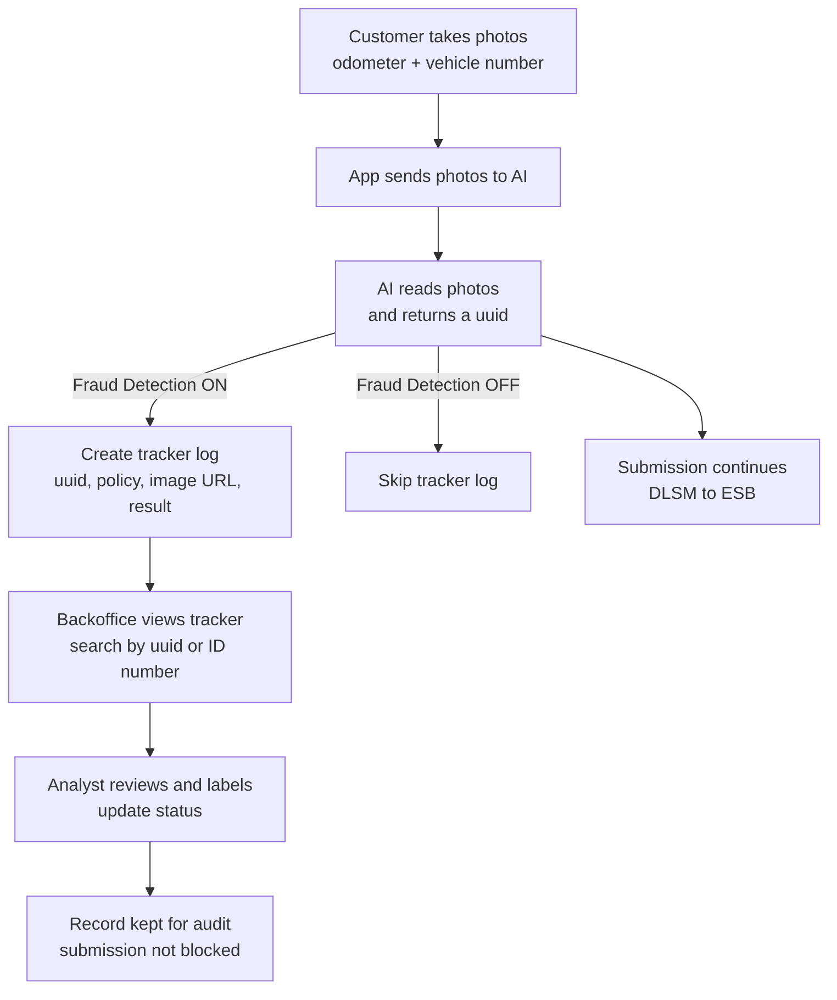

# DLSM Fraud Detection Tracker — Business Guide

This guide explains, in simple terms, how the DLSM Fraud Detection Tracker works, what it captures, where to view it, and how the review process functions. It does not block customer submissions — it supports later, manual review.

See also: [[DLSM Mobile — Index]] · [[DLSM Mobile — Glossary]]

---

## Plain-English Summary

- Customers upload two photos: one of the odometer and one of the vehicle number.
- Our AI reads the photos and returns a case ID (called a “uuid”).
- When Fraud Detection is ON, we log a tracker record with details (uuid, policy, image link, result) for later review in Backoffice.
- Operations teams check these tracker records and label them (e.g., Unreviewed → Confirmed Fraud / Not Fraud).
- This review is read-only and does not block customer DLSM submissions.

How do we spot suspicious requests?
- The AI step returns data (e.g., odometer value and vehicle number) and we also send metadata such as photo time and optional location.
- The system captures these details into a tracker log when Fraud Detection is ON.
- Reviewers look for red flags, for example:
  - Vehicle number read does not match the policy vehicle number.
  - Odometer value jumps unrealistically compared to previous records.
  - Photo taken time appears inconsistent with the submission timeline.
  - Optional proximity checks indicate photos were taken far apart in place or time.
  - Reused or repeated transaction IDs across different policies or users.

---

## Visual Flow (Layman Terms)

---

## What Gets Logged

- Case ID: the AI “uuid” to identify the submission.
- Policy and customer identifiers: used to search and group.
- Image URL: link to the generated image (from the AI image service).
- Request/Response snapshot: AI inputs/outputs for audit.
- Status: starts as “UNREVIEWED”; can be updated to “CONFIRMED_FRAUD” or “NOT_FRAUD”.
- History and Lock: who reviewed, when; optional soft lock to prevent concurrent edits.

---

## Where To View

- Backoffice-X
  - Menu: Tracker Logs → DLSM Fraud Detection
  - Filters: Transaction ID (uuid), Identity No., Status (e.g., UNREVIEWED), Date/Time Range.
  - Actions:
    - Lock/Unlock (optional — if enabled)
    - Review/Label: update to Confirmed Fraud or Not Fraud

---

## Key Notes For Business

- Non-Blocking: Even when flagged, submissions continue (no customer impact at point of upload).
- Designed For Review: Enables teams to spot suspicious cases and act later.
- Centralized: All cases can be searched by customer ID, policy, or uuid.
- Auditable: Each change is timestamped; the system keeps history.

---

## Configuration (ON/OFF)

- Toggle: `dlsm_fraud_detection_mode`
  - ON: logs are created automatically on AI responses.
  - OFF: no logs created; submissions continue as normal.
- Lock & Review Settings: Additional toggles exist for locking behavior during review.

---

## Typical Review Steps

1) Open Backoffice-X → DLSM Fraud Detection.
2) Filter by date range = “Last 7 days” and Status = “Unreviewed”.
3) Search by Identity No. or paste a known Transaction ID (uuid).
4) Open a record:
   - Check image URL and AI readings.
   - Compare against policy details if needed.
5) Choose a label:
   - Confirmed Fraud (if clearly suspicious)
   - Not Fraud (if everything is consistent)
6) Save — the status and history are updated.

---

## FAQs

- Does this block fraudulent users?
  - No. It is a dashboard for human review and follow-up. Submissions are not blocked by these labels.

- Do we always create a tracker record?
  - Only when Fraud Detection is enabled. When disabled, the flow works without tracker entries.

- Can I search by policy or just the uuid?
  - You can search by multiple fields: Transaction ID (uuid), Identity No., and date/time range.

- Who can label a record?
  - Authorized Backoffice users with the appropriate permission (e.g., VIEW_DLSM) and access.

---

Last updated: 2025-09-16
