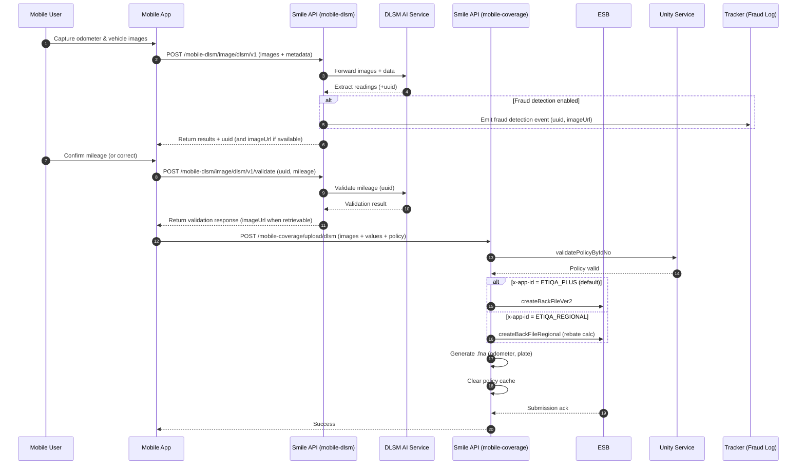

# DLSM Mobile Flow — Odometer AI + Submission (Current Behavior)

This guide documents how the current DLSM mobile flow works across two apps (ETIQA+ and Regional), from capturing the odometer reading with AI to submitting DLSM to ESB. It is intended for both business users and developers.

See also: [[DLSM Mobile — Odometer AI + ESB (Quick Overview)]]
Split per-app guides:
- [[DLSM Mobile - ETIQA Plus Flow]]
- [[DLSM Mobile - Regional Flow]]

Controllers and services cross‑checked:
- Submission API: `smile-aio/backend/apps/smile/src/mobile/mobile-coverage/mobile-coverage.controller.ts`
- AI APIs: `smile-aio/backend/apps/smile/src/mobile/mobile-dlsm/mobile-dlsm-new-odo.controller.ts`
- Business logic: `mobile-dlsm-bl.service.ts`, `mobile-dlsm-new-odo-BL.service.ts`, `mobile-dlsm-new-odo-DAL.service.ts`, `mobile-dlsm-ai.service.ts`
- ESB flow: `libs/shared/src/service/dlsm.service.ts`

---

## App Identification

- Header: `x-app-id` distinguishes app behavior.
  - Values: `ETIQA_PLUS` (default if header missing) and `ETIQA_REGIONAL`.
  - Decorator: `GetAppId()` reads `x-app-id` or defaults to `ETIQA_PLUS`.
- Auth: All endpoints require `Authorization: Bearer {{MOBILE_JWT}}`.

---

## Step-by-Step Flow

### 1) Capture Odometer and Vehicle Number via AI

Use AI endpoints under `mobile-dlsm` to extract readings from images and get a transaction `uuid` for validation. There are three options:

1. Odometer only
   - `POST /api/v5/mobile-dlsm/odometer/api/image`
   - Multipart body:
     - `imageFile` (file) — odometer image
     - `policyStart`, `policyNo`, `vehicleNo`, `mileage?`
     - `imageLat`, `imageLong`, `imageOdometerTakenTime`

2. Vehicle number only
   - `POST /api/v5/mobile-dlsm/vehicle-number`
   - Multipart body:
     - `imageFile` (file) — vehicle number image
     - `policyStart`, `policyNo`, `vehicleNo`
     - `imageLat`, `imageLong`, `imageVehnoTakenTime`

3. Combined (recommended): Odometer + Vehicle Number
   - `POST /api/v5/mobile-dlsm/image/dlsm/v1`
   - Multipart body:
     - `imageOdometer` (file), `imageVehno` (file)
     - `policyStart`, `policyNo`, `vehicleNo`, `mileage`
     - `imageOdometerTakenTime`, `imageVehnoTakenTime`
     - `latlongOdometer`, `latlongVehno`
   - Returns: a `uuid` (transaction id) and AI extraction results. When fraud detection is on, response is augmented with `imageUrl`.

Notes:
- File size limits are enforced by configuration: `DLSM_MAX_FILE_SIZE_IN_MB` and `DLSM_MAX_RESPONSE_SIZE_IN_MB` (default 10 MB).
- If either image is missing in the combined call, request fails with `400` (“Both odometer and vehicle number images are required”).
- AI health check: `GET /api/v5/mobile-dlsm/odometer/health`.

Important requirements (business):
- Odometer photo is compulsory for Activation and DLSM Rebate submission.
- Vehicle number photo is compulsory for Activation only (not required for Rebate submission).

Implementation details (dev):
- Controller: `mobile-dlsm-new-odo.controller.ts` delegates to BL → DAL → `MobileDlsmAIService`.
- AI service posts to external `DLSM_AI_URL`: endpoints `/odometer/api/image`, `/vehicle-no/api/image`, `/dlsm/api/image/dlsm/v1` using `multipart/form-data` with field names mapped accordingly.
- On success and when `dlsm_fraud_detection_mode` is enabled, `processFraudDetection` logs request/response + `uuid` and `imageUrl` via tracker events (non‑blocking).


### 2) Validate Odometer Reading (Manual Confirmation)

After getting the `uuid` from step 1, the app asks the user to confirm the odometer reading.

- `POST /api/v5/mobile-dlsm/image/dlsm/v1/validate`
- JSON body:
  - `uuid`: transaction id from step 1
  - `mileageValidation`: e.g., `"y"` to confirm
  - `mileage`: number (final mileage to use)
- Behavior:
  - Sends a validation request to the AI service (`/dlsm/api/image/dlsm/v1/validate`).
  - On success, response is augmented with `imageUrl` when retrievable.
  - Tracker event is emitted on failure to attach the image URL (non‑blocking).

Notes (business):
- This step captures explicit user confirmation to mitigate OCR/vision misreads.
- The fraud detection log is read‑only and does not block proceeding.


### 3) Submit DLSM to ESB (Per App Behavior)

Use the mobile coverage endpoint to submit DLSM payload and images to the backend, which handles ESB integration.

- `POST /api/v5/mobile-coverage/upload/dlsm`
- Headers:
  - `Authorization: Bearer {{MOBILE_JWT}}`
  - `x-app-id: ETIQA_PLUS | ETIQA_REGIONAL` (default ETIQA_PLUS if omitted)
- Multipart body:
  - Images: `odometer_image`, `plate_number_image`
  - Timestamps: `odometer_image_timestamp`, `plate_number_image_timestamp`
  - Values: `odometer_value`, `plate_number_value`
  - Policy: `policy_no`, `policy_entity`, `inception_date`, `maturity_expiry_date`
  - Other: `request_type` (e.g., `activation`), `upload_method_code` (e.g., `UMC0`)
  - Optional (Regional support): `bank_code`, `bank_account_no` (used in Regional flow when provided)
  - Regional (Option C): `uuid` (string) — REQUIRED for `ETIQA_REGIONAL` submissions; optional for ETIQA_PLUS

Server-side processing:
- Policy validation: `unityService.validatePolicyByIdNo(...)`. If not found, returns error `NO_POLICIES_FOUND`.
- Branch by app id:
  - `ETIQA_PLUS` → `dlsmService.createBackFileVer2(...)` (newer path for ETIQA+). `uuid` is optional (used for correlation only).
  - `ETIQA_REGIONAL` → `dlsmService.createBackFileRegional(...)` (Regional flow; includes rebate calculation call). Under Option C, `uuid` presence is required (400 `DLSM.UUID_REQUIRED` if missing).
- File handling:
  - Uploaded files validated and placed into per‑upload folders (odometer vs plate number). Temp folders are cleaned.
  - Server generates `.fna` files (one per image) when folders are non‑empty: `createOdometerFna(...)`, `createPlateNoFna(...)`.
- Caching:
  - Policy cache is cleared via `cacheUtilService.deleteCustomerMdmPolicies(idNo)` to ensure fresh summary data post‑submission.
- Logging format:
  - New/old submission log format can be toggled via configuration (`dlsm_new_log_mode`).

Notes:
- Fraud detection logs do not block submission (as per current business rules). Review is manual.
- If files are missing on disk during validation, upload is treated as quarantined; custom errors are thrown with file path context.

---

## Field Rules and Validations (Key Points)

- `odometer_value`: positive integer; max `999,999`.
- Missing images in combined AI call → 400 error.
- File size limits applied by `MobileDlsmAIService` using config (defaults to 10 MB).
- For `mobile-coverage` submission, default app is `ETIQA_PLUS` when `x-app-id` is not provided.
- Business rule: Odometer photo is compulsory for Activation and Rebate; Vehicle number photo is compulsory for Activation only.

---

## Configuration Flags (Observed)

- `dlsm_fraud_detection_mode` — Toggles fraud detection logging and tracker emission on AI responses (read‑only, non‑blocking).
- `dlsm_new_log_mode` — Switches to new submission log format; used to roll back to old format if needed.
- `backoffice_manual_dlsm_submission_new_log_mode` — Similar flag for backoffice manual submission logging.
- AI limits: `DLSM_MAX_FILE_SIZE_IN_MB`, `DLSM_MAX_RESPONSE_SIZE_IN_MB`.
- AI endpoints base: `DLSM_AI_URL`; image URL base: `DLSM_AI_IMAGE_URL`.

---

## Developer Notes (Request Mapping)

- AI service (`MobileDlsmAIService`) remaps DTO fields to AI API fields:
  - Odometer: `{ policy_start, policy_no, vehicle_no, mileage, image_odometer_taken_time, image_lat, image_long, image_file }`
  - Vehicle no: `{ policy_start, policy_no, vehicle_no, image_vehno_taken_time, image_lat, image_long, image_file }`
  - Combined: `{ policy_start, policy_no, vehicle_no, mileage, image_odometer_taken_time, image_vehno_taken_time, latlong_odometer, latlong_vehno, image_odometer, image_vehno }`
- Validation call: `POST {DLSM_AI_URL}/dlsm/api/image/dlsm/v1/validate` with `multipart/form-data` `{ uuid, mileage, mileage_validation }`.
- Health: `GET {DLSM_AI_URL}/dlsm/health`.

---

## Example Calls (Postman Collections)

- Combined AI flow: `postman/Mobile DLSM (New Odometer) E2E.postman_collection.json`
- Mobile coverage submission: `postman/mobile-coverage-upload-dlsm.postman_collection.json`

---

## Business Summary

1. Customer captures odometer and vehicle number images.
2. AI extracts readings and returns a `uuid`. The app asks user to confirm the reading.
3. User confirms mileage (or corrects) → system validates with AI using the `uuid`.
4. System submits DLSM to ESB. Behavior differs by app id:
   - ETIQA+: standard submission flow.
   - Regional: includes rebate calculation and optional bank info.
5. Fraud detection logging (if enabled) stores non‑blocking, read‑only records for manual review.

---

## Troubleshooting

- 400 “Both images required”: Ensure both `imageOdometer` and `imageVehno` are attached in combined AI call.
- File too large: Check `DLSM_MAX_FILE_SIZE_IN_MB` and compress images.
- Policy not found: Submission rejects with `NO_POLICIES_FOUND`. Verify policy ownership and identifiers.
- Missing `x-app-id`: Defaults to `ETIQA_PLUS`.

---

Last updated: 2025-09-16

---

## Sequence Diagram



---

## Tester Checklist

- Pre-reqs:
  - Ensure `x-app-id` is set (test both `ETIQA_PLUS` and `ETIQA_REGIONAL`).
  - Confirm AI config: `DLSM_AI_URL`, `DLSM_MAX_FILE_SIZE_IN_MB`.
  - Toggle `dlsm_fraud_detection_mode` to verify tracker behavior (non-blocking).

- Positive tests:
  - Combined AI call returns 200 + `uuid`; images present; correct mapping of metadata.
  - Manual validate returns 200; `imageUrl` attached when resolvable.
  - Submission with valid policy returns Success; cache cleared; `.fna` files generated when folders populated.
  - Regional path: rebate calculation executed; optional bank fields accepted when provided.

- Negative tests:
  - Missing one image on combined call → 400 with clear message.
  - Odometer value > 999,999 or non-integer → validation error.
  - Oversized image (> configured limit) → processing fail from AI service.
  - Policy not found → `NO_POLICIES_FOUND` on submission.

- Headers/auth:
  - Omit `x-app-id` → defaults to `ETIQA_PLUS`.
  - Missing/invalid JWT → rejected by `MobileAuthGuard`.

- Observability:
  - When fraud detection enabled, verify tracker events contain `uuid` and `imageUrl` (read-only, non-blocking).

---

## Example Responses

- Odometer (AI read)
```json
{
  "policy_no": "PU123456",
  "mileage": 12345,
  "code": 200,
  "message": "success",
  "event_datetime": "2025-01-01T10:00:00Z",
  "policy_start": "2024-01-01",
  "predicted_mileage": 12345,
  "uuid": "b3a1f9e0-1234-4a6a-9c77-11aa22bb33cc",
  "vehicle_no": "ABC1234",
  "imageUrl": "https://ai.example.com/api/image/b3a1f9e0-1234-4a6a-9c77-11aa22bb33cc"
}
```

- Vehicle number (AI read)
```json
{
  "policy_no": "PU123456",
  "predicted_vehicle_no": "ABC1234",
  "code": 200,
  "message": "success"
}
```

- Odometer validation (manual)
```json
{
  "uuid": "b3a1f9e0-1234-4a6a-9c77-11aa22bb33cc",
  "mileage": 12345,
  "code": 200,
  "message": "updated"
}
```

- Combined DLSM validation (images)
```json
{
  "policy_no": "PU123456",
  "mileage": 12345,
  "code": 200,
  "message": "validated"
}
```
