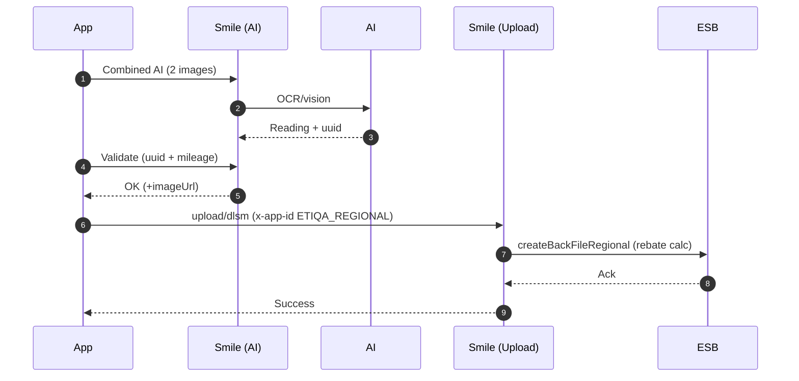

# DLSM Mobile — Regional (AI + ESB)

Step-by-step guide for Regional app behavior. App detection via `x-app-id: ETIQA_REGIONAL`.

Important requirements:
- Odometer photo is compulsory for Activation and DLSM Rebate submission.
- Vehicle number photo is compulsory for Activation only (not required for Rebate submission).

---

## 1) Capture Readings with AI

- Combined endpoint (recommended): `POST /api/v5/mobile-dlsm/image/dlsm/v1`
  - Body (multipart): `imageOdometer`, `imageVehno`, `policyStart`, `policyNo`, `vehicleNo`, `mileage`, `imageOdometerTakenTime`, `imageVehnoTakenTime`, `latlongOdometer`, `latlongVehno`
  - Output: AI readings + `uuid`. When fraud logging enabled, response may include `imageUrl`.
- Odometer-only: `POST /api/v5/mobile-dlsm/odometer/api/image`
- Vehicle-no-only: `POST /api/v5/mobile-dlsm/vehicle-number`
- Health: `GET /api/v5/mobile-dlsm/odometer/health`

Notes:
- Both images required for combined call; otherwise 400 error.
- File size limits via config (default 10 MB).

---

## 2) Validate Odometer (Manual Confirmation)

- `POST /api/v5/mobile-dlsm/image/dlsm/v1/validate`
  - Body (JSON): `uuid`, `mileageValidation` (e.g., "y"), `mileage`
  - Sends validation to AI; returns confirmation and `imageUrl` when resolvable. Non-blocking fraud logs may be emitted.

---

## 3) Submit DLSM (Regional Path)

- Endpoint: `POST /api/v5/mobile-coverage/upload/dlsm`
  - Headers: `Authorization: Bearer {{MOBILE_JWT}}`, `x-app-id: ETIQA_REGIONAL`
  - Body (multipart):
    - Images: `odometer_image`, `plate_number_image`
    - Timestamps: `odometer_image_timestamp`, `plate_number_image_timestamp`
    - Values: `odometer_value`, `plate_number_value`
    - Policy: `policy_no`, `policy_entity`, `inception_date`, `maturity_expiry_date`, `poi_start_date?`
    - Other: `request_type` (e.g., activation), `upload_method_code` (e.g., UMC0)
    - Regional REQUIRED: `uuid` (string) — transaction id from Step 1 (AI)
    - Optional (supported here): `bank_code`, `bank_account_no`

Server behavior:
- Validates policy with `unityService.validatePolicyByIdNo`.
- Requires `uuid` presence (Option C). If missing: 400 `DLSM.UUID_REQUIRED`.
- Calls `dlsmService.createBackFileRegional(...)` (Regional flow), which:
  - Builds a `SubmitDlsmRegionalDto` including odometer value, dates, policy/vehicle details, and optional bank info.
  - Invokes rebate calculation via `dlsmRegionalService.submitDlsmRebateCalculation(...)`.
- Generates `.fna` files for odometer and plate images (when present); cleans temp folders.
- Clears customer policy cache to ensure fresh summary.

---

## Request Examples

- Multipart form-data (Regional with uuid)
```
odometer_image: (file) odometer.jpg
plate_number_image: (file) plate.jpg
request_type: activation
odometer_image_timestamp: 2025-01-01T08:00:00Z
plate_number_image_timestamp: 2025-01-01T08:00:05Z
plate_number_value: ABC1234
odometer_value: 12345
policy_no: PU123456
policy_entity: 1
inception_date: 2024-01-01T00:00:00Z
maturity_expiry_date: 2025-12-31T23:59:59Z
upload_method_code: UMC0
uuid: b3a1f9e0-1234-4a6a-9c77-11aa22bb33cc
```

---

## Developer Pointers

- Controllers: `mobile-dlsm-new-odo.controller.ts`, `mobile-coverage.controller.ts`
- Services: `mobile-dlsm-new-odo-*.ts`, `mobile-dlsm-ai.service.ts`, `libs/shared/src/service/dlsm.service.ts`
- Config flags: `dlsm_fraud_detection_mode`, `dlsm_new_log_mode`, AI limits (`DLSM_MAX_*`)

---

## API Response DTOs (Fields)

- Odometer (AI read) — `apps/smile/src/mobile/_dto/dlsm/dlsm-odometer-response.dto.ts`
  - `policy_no: string`
  - `mileage: number`
  - `code: number`
  - `message: string`
  - `event_datetime: string`
  - `policy_start: string`
  - `predicted_mileage: number`
  - `uuid: string`
  - `vehicle_no: string`
  - `imageUrl: string`

- Vehicle number (AI read) — `apps/smile/src/mobile/_dto/dlsm/dlsm-vehicle-number-response.dto.ts`
  - `policy_no: string`
  - `predicted_vehicle_no: string`
  - `code: number`
  - `message: string`

- Odometer validation (manual) — `apps/smile/src/mobile/_dto/dlsm/dlsm-odometer-validation-response.dto.ts`
  - `uuid: string`
  - `mileage: number`
  - `code: number`
  - `message: string`

- Combined DLSM validation (images) — `apps/smile/src/mobile/_dto/dlsm/dlsm-response.dto.ts`
  - `policy_no: string`
  - `mileage: number`
  - `code: number`
  - `message: string`

---

## Example Responses

- Odometer (AI read)
```json
{
  "policy_no": "PU123456",
  "mileage": 12345,
  "code": 200,
  "message": "success",
  "event_datetime": "2025-01-01T10:00:00Z",
  "policy_start": "2024-01-01",
  "predicted_mileage": 12345,
  "uuid": "b3a1f9e0-1234-4a6a-9c77-11aa22bb33cc",
  "vehicle_no": "ABC1234",
  "imageUrl": "https://ai.example.com/api/image/b3a1f9e0-1234-4a6a-9c77-11aa22bb33cc"
}
```

- Vehicle number (AI read)
```json
{
  "policy_no": "PU123456",
  "predicted_vehicle_no": "ABC1234",
  "code": 200,
  "message": "success"
}
```

- Odometer validation (manual)
```json
{
  "uuid": "b3a1f9e0-1234-4a6a-9c77-11aa22bb33cc",
  "mileage": 12345,
  "code": 200,
  "message": "updated"
}
```

- Combined DLSM validation (images)
```json
{
  "policy_no": "PU123456",
  "mileage": 12345,
  "code": 200,
  "message": "validated"
}
```

- Upload DLSM (Regional)
```json
{
  "status": 200,
  "message": "OK",
  "data": {
    "rebateCalculation": {
      "amount": 12.34,
      "currency": "MYR"
    }
  }
}
```
Note: Regional response structure is ESB-provided and may vary; the above is illustrative.

---

## Code References

- Controllers: `mobile/mobile-dlsm/mobile-dlsm-new-odo.controller.ts`, `mobile/mobile-coverage/mobile-coverage.controller.ts`
- Services: `mobile/mobile-dlsm/mobile-dlsm-*.ts`, `libs/shared/src/service/dlsm.service.ts`
- DTOs: `apps/smile/src/mobile/_dto/dlsm/*.dto.ts`
- Config: `DLSM_AI_URL`, `DLSM_AI_IMAGE_URL`, `DLSM_MAX_FILE_SIZE_IN_MB`, `DLSM_MAX_RESPONSE_SIZE_IN_MB`, flags under configuration collection/migrations.
- Glossary: [[DLSM Mobile — Glossary]]
 - Enhancement Plan: [[DLSM Enhancement Plan — Step Linkage (Option C)]]

---

## Quick Diagram



---

Last updated: 2025-09-16
