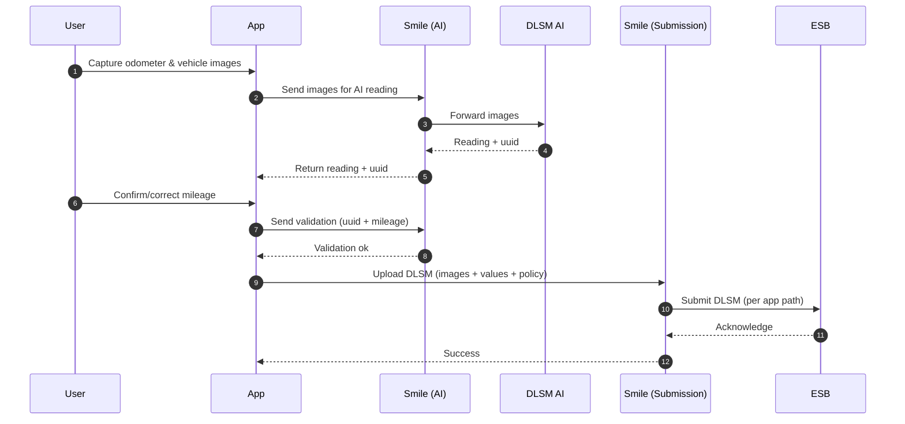

# DLSM Mobile — Odometer AI + ESB (Quick Overview)

A business-friendly overview of how DLSM works on mobile: AI reads odometer and vehicle number from images, user confirms mileage, then submission goes to ESB. Two apps are supported and auto-detected by header.

- Apps: `ETIQA_PLUS` (default) and `ETIQA_REGIONAL` via `x-app-id` header.
- Auth: All calls require `Authorization: Bearer {{MOBILE_JWT}}`.

Detailed guide: [[DLSM Mobile - Odometer AI and Submission (Current Behavior)]]
Per-app guides: [[DLSM Mobile - ETIQA Plus Flow]] · [[DLSM Mobile - Regional Flow]]

---

## Simple Steps

1) Take Photos
- Capture odometer and vehicle number images in the app.

2) AI Reads + Gives a Ticket (uuid)
- App sends images to AI. AI returns the reading and a `uuid` transaction id.

3) Confirm the Reading
- App asks user to confirm/correct the mileage; app sends confirmation with the `uuid` back to AI.

4) Submit to ESB
- App uploads images + values for DLSM submission. Backend picks the right path based on `x-app-id`:
  - ETIQA+: standard submission path.
  - Regional: includes rebate calculation and optional bank info.

5) Review (Optional)
- If fraud detection logging is on, details are stored for manual review (does not block the submission).

Important requirements:
- Odometer photo is compulsory for Activation and DLSM Rebate submission.
- Vehicle number photo is compulsory for Activation only (not required for Rebate submission).

---

## Visual Flow

---

## What To Check

- Does `x-app-id` match the app? (ETIQA_PLUS default if missing)
- Are both images provided for the combined AI step?
- Does the AI step return a `uuid` and reading?
- Can the user confirm mileage and does the validation succeed?
- Does submission succeed for both apps? (ETIQA_PLUS and ETIQA_REGIONAL)
- If fraud logs are enabled, do entries appear (non‑blocking)?

Regional note (Option C): Step 3 requires `uuid` from Step 1; ETIQA_PLUS does not.

---

Last updated: 2025-09-16
