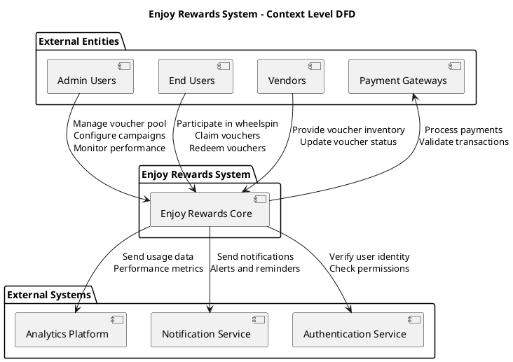
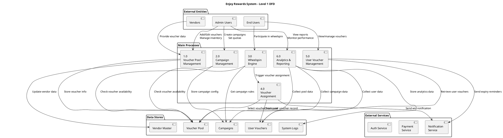
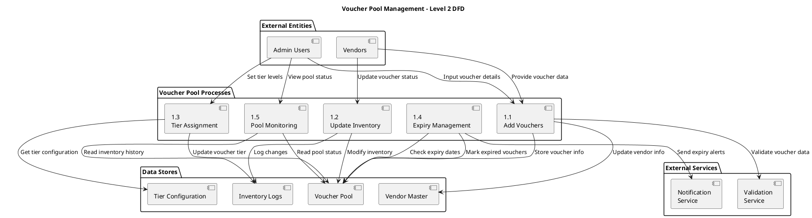
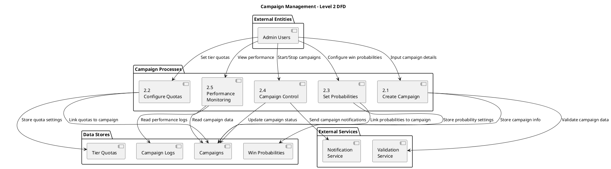
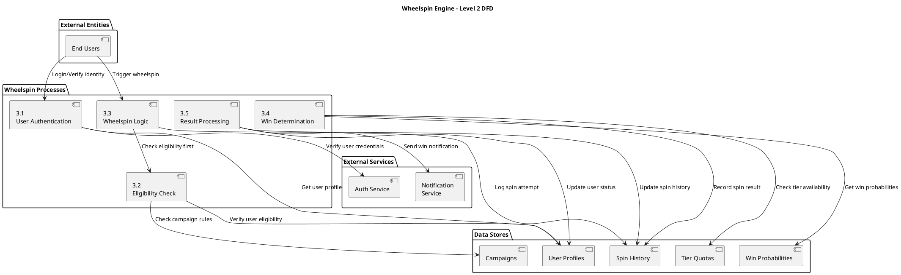
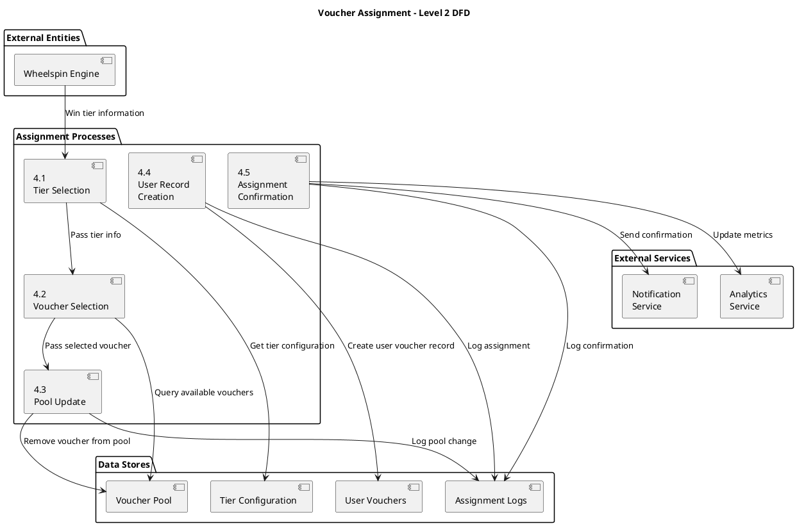
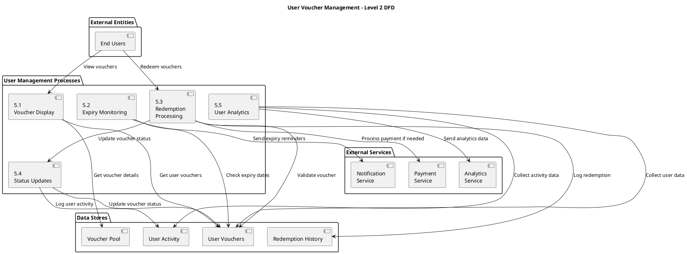
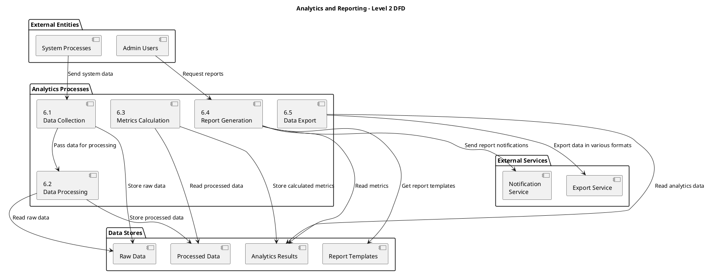

# Enjoy Rewards System - Data Flow Diagrams (DFD)

  

## Overview

This document contains Data Flow Diagrams (DFD) for the Enjoy Rewards system, showing how data flows between different system components, external entities, and data stores.

  

---

  

## 1. Context Level DFD (Level 0)

  

  

---

  

## 2. Level 1 DFD - Main System Processes

  

  

---

  

## 3. Level 2 DFD - Voucher Pool Management

  

  

---

  

## 4. Level 2 DFD - Campaign Management

  

  

---

  

## 5. Level 2 DFD - Wheelspin Engine

  

  

---

  

## 6. Level 2 DFD - Voucher Assignment

  

  

---

  

## 7. Level 2 DFD - User Voucher Management

  

  

---

  

## 8. Level 2 DFD - Analytics and Reporting

  

  

---

  

## 9. Data Dictionary

  

### **Data Stores**

  

#### **Voucher Pool (POOL_DB)**

- `voucher_id`: Unique identifier

- `vendor_id`: Reference to vendor

- `name`: Voucher name

- `description`: Voucher description

- `value`: Monetary value

- `tier_level`: Tier assignment (1, 2, 3...)

- `vendor_expiry`: Original vendor expiry date

- `system_expiry_days`: Days from claim to expiry

- `quantity`: Available quantity

- `status`: Active/Inactive/Expired

- `created_at`: Creation timestamp

- `updated_at`: Last update timestamp

  

#### **Campaigns (CAMPAIGN_DB)**

- `campaign_id`: Unique identifier

- `name`: Campaign name

- `description`: Campaign description

- `start_date`: Campaign start date

- `end_date`: Campaign end date

- `status`: Draft/Active/Paused/Ended

- `eligibility_rules`: JSON configuration

- `created_at`: Creation timestamp

- `updated_at`: Last update timestamp

  

#### **Tier Quotas (QUOTA_DB)**

- `quota_id`: Unique identifier

- `campaign_id`: Reference to campaign

- `tier_level`: Tier number

- `voucher_limit`: Maximum vouchers for tier

- `vouchers_used`: Current usage count

- `win_probability`: Win percentage

- `created_at`: Creation timestamp

  

#### **User Vouchers (USER_DB)**

- `user_voucher_id`: Unique identifier

- `user_id`: Reference to user

- `voucher_id`: Reference to voucher

- `campaign_id`: Reference to campaign

- `claimed_at`: Claim timestamp

- `system_expiry`: System expiry date

- `status`: Active/Expired/Redeemed

- `redemption_details`: Redemption information

- `created_at`: Creation timestamp

  

#### **Vendor Master (VENDOR_DB)**

- `vendor_id`: Unique identifier

- `name`: Vendor name

- `category`: Vendor category

- `contact_info`: Contact details

- `redemption_instructions`: How to redeem

- `status`: Active/Inactive

- `created_at`: Creation timestamp

  

### **Data Flows**

  

#### **Voucher Addition Flow**

1. Admin inputs voucher details

2. System validates data

3. Voucher stored in pool

4. Inventory updated

5. Confirmation sent

  

#### **Campaign Creation Flow**

1. Admin configures campaign

2. System validates configuration

3. Campaign stored in database

4. Quotas and probabilities set

5. Campaign activated

  

#### **Wheelspin Flow**

1. User authenticates

2. System checks eligibility

3. User spins wheel

4. System determines win

5. Voucher assigned

6. Pool updated

7. User notified

  

#### **Voucher Assignment Flow**

1. Win tier determined

2. Voucher selected from pool

3. Pool inventory updated

4. User record created

5. Assignment confirmed

6. Analytics updated

  

---

  

## 10. System Integration Points

  

### **External Service Integrations**

- **Authentication Service**: User verification and session management

- **Notification Service**: Push notifications, emails, SMS

- **Payment Service**: Transaction processing and validation

- **Analytics Platform**: Data aggregation and reporting

- **Vendor APIs**: Real-time voucher status updates

  

### **Data Synchronization**

- **Real-time Updates**: Pool status, campaign metrics

- **Batch Processing**: Daily expiry checks, analytics generation

- **Event-driven Updates**: Voucher assignments, status changes

- **Scheduled Tasks**: Pool monitoring, report generation

  

---

  

## Usage Instructions

  

1. **Copy each PlantUML code block** into a PlantUML editor

2. **Generate DFD diagrams** for system documentation

3. **Export as PNG/SVG** for presentations and documentation

4. **Update diagrams** as system architecture evolves

  

These DFDs provide a comprehensive view of data flow in the Enjoy Rewards system and can be used for:

- System architecture planning

- Database design

- API development

- Integration planning

- Security analysis

- Performance optimization