# Voucher Journey Sequence Diagrams - Enjoy Rewards System

  

## Overview

This document contains sequence diagrams illustrating the complete voucher journey from initial setup through user claim, including edge cases and error handling scenarios.

  

---

  

## 1. Complete Voucher Journey - Happy Path (Wheelspin)

  

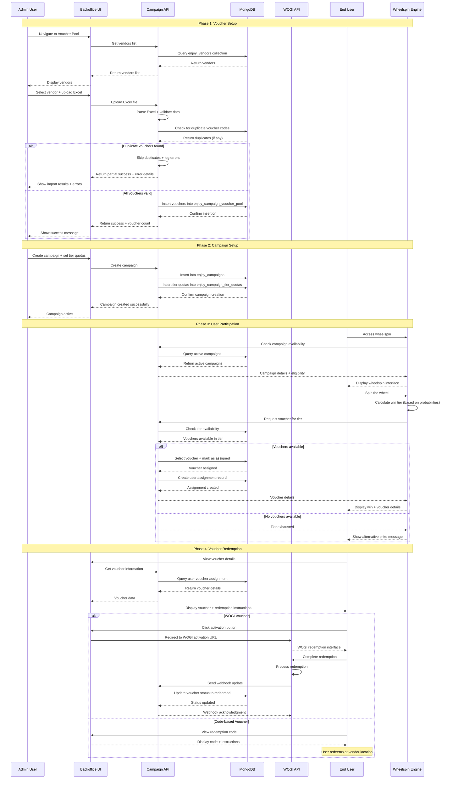

  

---

  

## 1b. Direct Voucher Claiming - No Wheelspin (Alternative Flow)

  

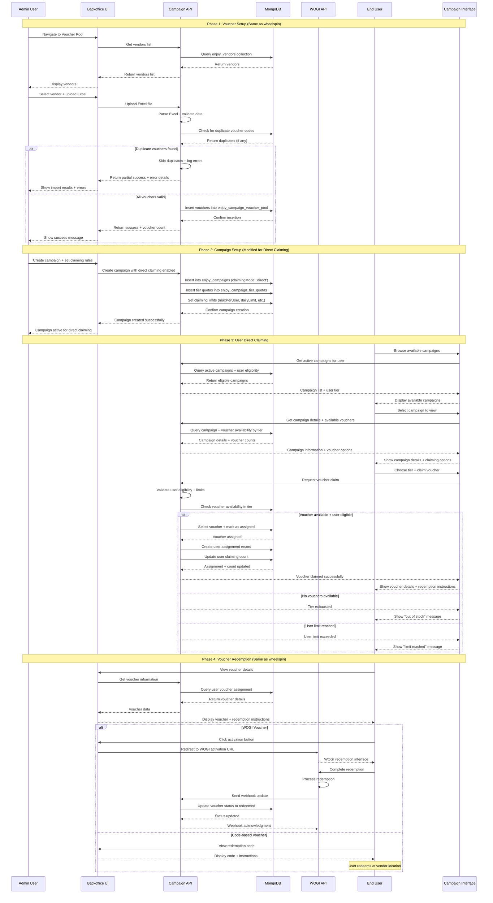

  

---

  

## 2. Edge Case: Duplicate Voucher Import

  

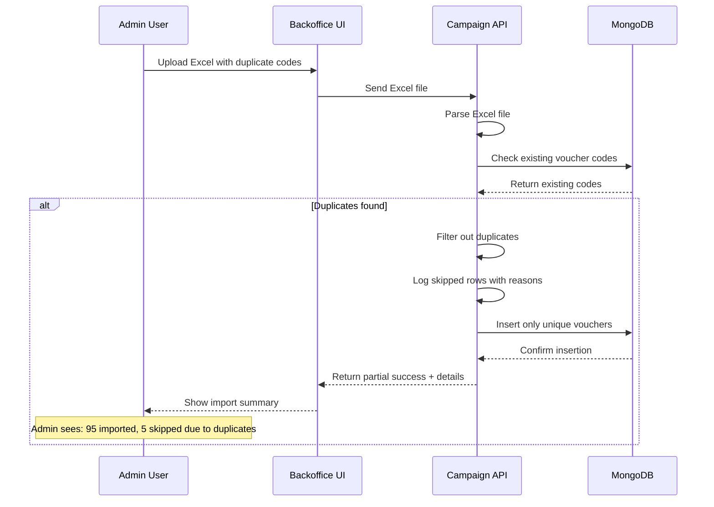

  

---

  

## 3. Edge Case: Tier Exhaustion During Wheelspin

  

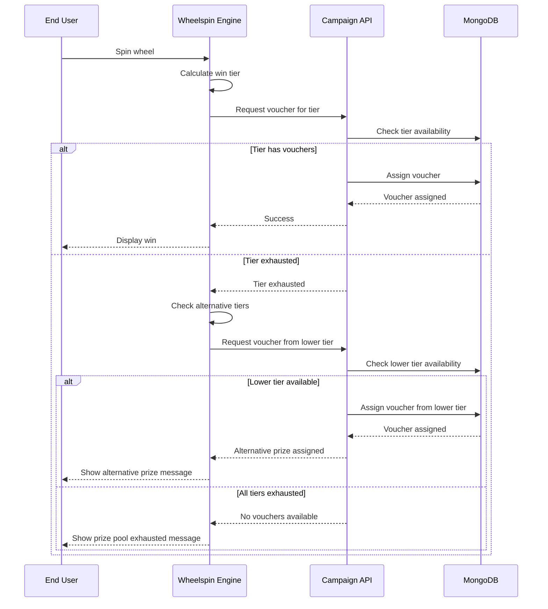

  

---

  

## 4. Edge Case: User Ineligibility

  

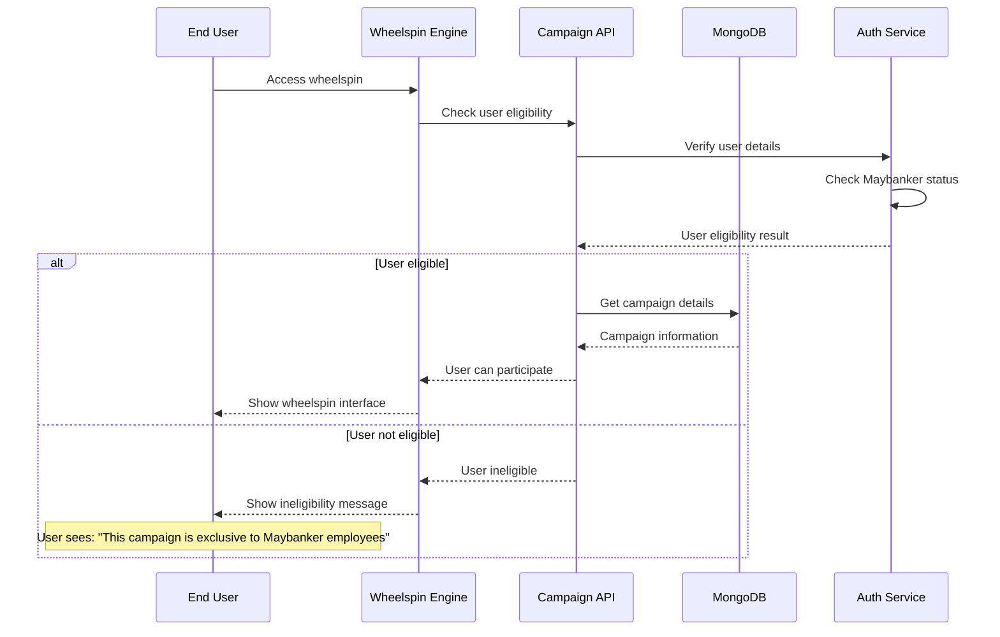

  

---

  

## 5. Edge Case: Voucher Expiry During Process

  

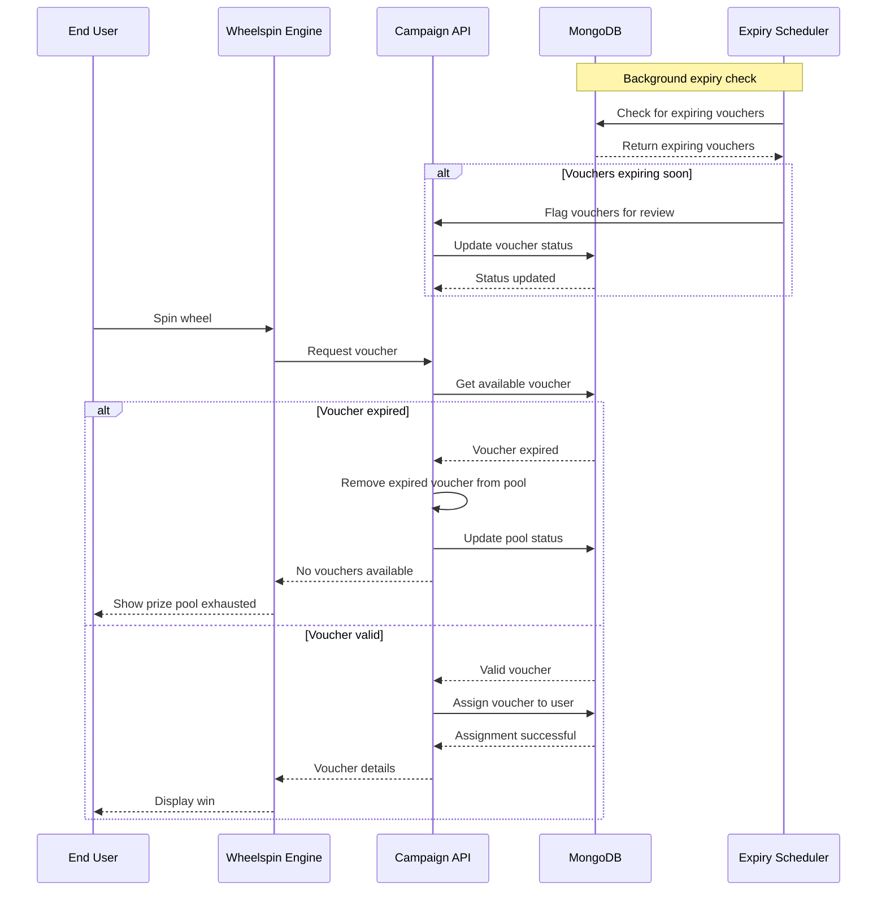

  

---

  

## 6. Edge Case: WOGI API Failure

  

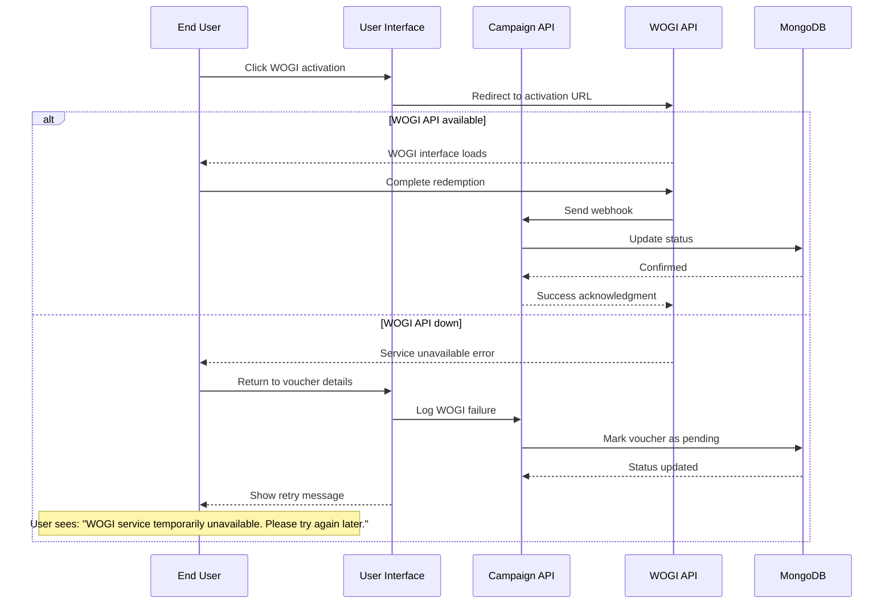

  

---

  

## 7. Edge Case: Campaign Quota Management

  

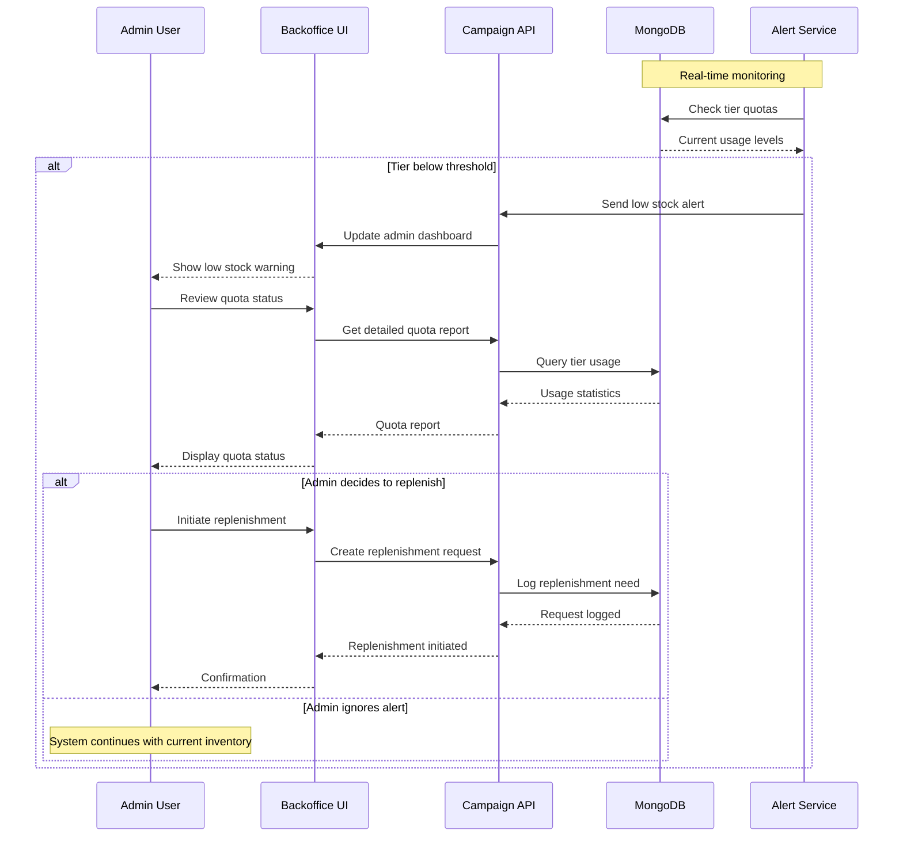

  

---

  

## 8. Edge Case: User Multiple Claims Prevention

  

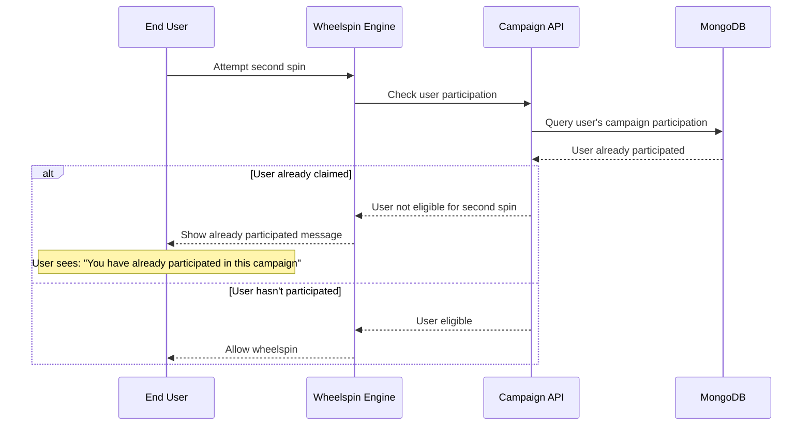

  

---

  

## 9. Edge Case: System Maintenance Mode

  

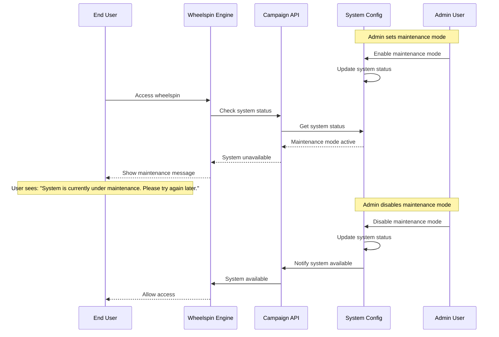

  

---

  

## 10. Edge Case: Direct Claiming - User Limit Reached

  

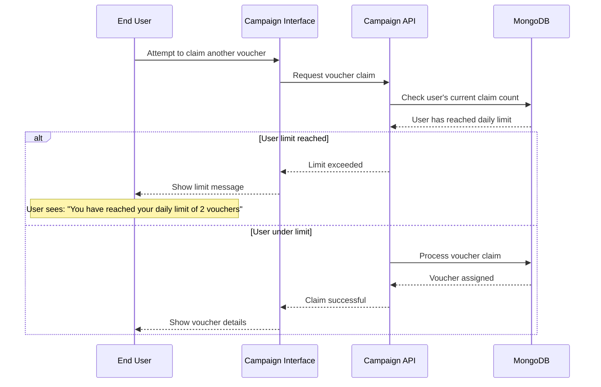

  

---

  

## Key Edge Cases Covered:

  

### **Data Validation**

- ✅ Duplicate voucher codes

- ✅ Invalid Excel formats

- ✅ Missing required fields

  

### **System Availability**

- ✅ WOGI API failures

- ✅ Database connection issues

- ✅ Maintenance mode handling

  

### **Business Rules**

- ✅ User eligibility checks

- ✅ Campaign quota enforcement

- ✅ Multiple claim prevention

- ✅ Daily/overall claim limits

  

### **Resource Management**

- ✅ Tier exhaustion handling

- ✅ Alternative prize assignment

- ✅ Quota replenishment alerts

  

### **Error Recovery**

- ✅ Graceful degradation

- ✅ User-friendly error messages

- ✅ Retry mechanisms

  

---

  

## Usage Instructions:

  

1. **Copy Mermaid code** to any Mermaid-compatible editor

2. **View in GitHub/GitLab** for automatic rendering

3. **Use in Obsidian** with Mermaid plugin

4. **Export as images** for presentations

  

---

  

**These sequence diagrams provide a complete view of the voucher journey, including all edge cases and error handling scenarios!** 🎯