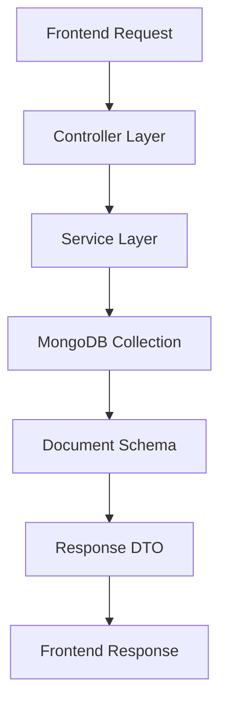

# Backend Single Document Retrieval Pattern Guide

> **Author**: Senior Developer  
> **Audience**: Junior Developers  
> **Context**: NestJS + MongoDB + Backoffice System  
> **Date**: 2025-09-20

## 📋 Overview

This guide demonstrates how to implement a **single document retrieval endpoint** in our backoffice backend system. We'll analyze the `getVoucherConfig` endpoint as our reference implementation.

## 🎯 Learning Objectives

By the end of this guide, you'll understand:
- How to structure a single document retrieval endpoint
- MongoDB collection patterns and schema design
- Service layer implementation with error handling
- Security and validation best practices
- Response DTO mapping patterns

---

## 🏗️ Architecture Overview



**Flow**: `Controller` → `Service` → `MongoDB` → `DTO Mapping` → `Response`

---

## 📂 File Structure Analysis

### 1. **Controller Layer**
```
📁 backend/apps/backoffice/src/portal/portal-enjoy-rewards/
├── portal-enjoy-rewards.controller.ts  ← API endpoint definition
└── dto/
    └── voucher-config.dto.ts           ← Response DTO types
```

### 2. **Service Layer**
```
📁 backend/apps/backoffice/src/portal/portal-enjoy-rewards/
└── portal-enjoy-rewards.service.ts     ← Business logic implementation
```

### 3. **Schema Layer**
```
📁 backend/libs/shared/src/mongo-schema/
└── reward-local-voucher-config.schema.ts ← MongoDB document structure
```

---

## 🔍 Step-by-Step Implementation

### **Step 1: Define the MongoDB Schema**

**File**: `libs/shared/mongo-schema/reward-local-voucher-config.schema.ts`

```typescript
@Schema({
  collection: 'rewards.voucher.config',  // ← Collection name in MongoDB
  timestamps: true,                      // ← Auto createdAt/updatedAt
  autoIndex: true,                       // ← Auto-create indexes
})
export class EnjoyVoucherConfig {
  @Prop({ required: true })
  gatewayId: number;

  @Prop({ required: true, unique: true })
  voucherCode: string;

  @Prop({ required: false })
  productName?: string;

  // ... other fields
}
```

**Key Points**:
- **Collection Name**: `rewards.voucher.config` (MongoDB collection)
- **Timestamps**: Automatic `createdAt` and `updatedAt` fields
- **Indexes**: Performance optimization for queries
- **Validation**: Required fields and unique constraints

### **Step 2: Create Response DTO**

**File**: `portal-enjoy-rewards/dto/voucher-config.dto.ts`

```typescript
export class VoucherConfigResponseDto {
  _id: string;
  gatewayId: number;
  voucherCode: string;
  productName: string;
  maxClaimedQuantityPerUser: number;
  availableQuantity: number;
  isProductBeingShown: boolean;
  createdAt: Date;
  updatedAt: Date;
  vouchers?: any[]; // Related voucher instances
}
```

**Purpose**: 
- **Type Safety**: Ensures consistent response structure
- **Documentation**: Self-documenting API responses
- **Validation**: Frontend knows exactly what to expect

### **Step 3: Implement Service Method**

**File**: `portal-enjoy-rewards.service.ts`

```typescript
@Injectable()
export class PortalEnjoyRewardsService {
  constructor(
    @InjectModel(EnjoyVoucherConfig.name, 'etiqaplus')
    private enjoyVoucherConfig: PaginateModel<EnjoyVoucherConfigDocument>,
  ) {}

  async getVoucherConfig(
    voucherId: string | number,
  ): Promise<VoucherConfigResponseDto> {
    // 1. Log the operation
    this.logger.log(`Getting voucher config for voucherId: ${voucherId}`);

    // 2. Query the database
    const config = await this.enjoyVoucherConfig.findById(voucherId);

    // 3. Handle not found case
    if (!config) {
      throw new CustomException(
        CommonError.ENJOY_REWARDS.VOUCHER_INSTANCE_NOT_FOUND,
      );
    }

    // 4. Get related data (if needed)
    const voucherInstances = await this.voucherSetupService
      .getVoucherInstanceByVoucherCode(config.voucherCode);

    // 5. Map to response DTO
    const responseData: VoucherConfigResponseDto = {
      _id: config._id.toString(),
      gatewayId: config.gatewayId,
      voucherCode: config.voucherCode,
      productName: config.productName,
      // ... map all required fields
      vouchers: voucherInstances, // Include related data
    };

    return responseData;
  }
}
```

**Key Patterns**:
- **Dependency Injection**: `@InjectModel` for MongoDB access
- **Error Handling**: Throw custom exceptions for not found
- **Logging**: Track operations for debugging
- **DTO Mapping**: Transform database document to API response
- **Related Data**: Fetch associated documents when needed

### **Step 4: Create Controller Endpoint**

**File**: `portal-enjoy-rewards.controller.ts`

```typescript
@Controller('portal-enjoy-rewards')
export class PortalEnjoyRewardsController {
  
  @Get('rewards/voucher-config/:productId')           // ← URL pattern
  @ApiBearerAuth('access-token')                      // ← Authentication
  @UseGuards(AdminGuard, BackofficeRoleGuard)        // ← Authorization
  @Permissions(                                       // ← Permission check
    MainConst.PERMISSION.VIEW_ENJOY_REWARD,
    MainConst.PERMISSION.MANAGE_ENJOY_REWARD,
  )
  @ApiOkResponse({                                    // ← Swagger docs
    type: VoucherConfigResponseDto,
  })
  @ApiResponse({                                      // ← Error docs
    status: BackofficeError.COMMON.INVALID.statusCode,
    description: BackofficeError.COMMON.INVALID.message,
  })
  @ApiOperation({                                     // ← Operation docs
    summary: 'Get voucher config by gatewayId',
    description: 'Get a single voucher config by gatewayId',
  })
  async getVoucherConfig(
    @Param('productId') productId: string | number,   // ← Extract URL param
  ): Promise<VoucherConfigResponseDto> {
    return this.portalEnjoyRewardsService.getVoucherConfig(productId);
  }
}
```

**Security Layers**:
1. **Authentication**: `@ApiBearerAuth` - Valid JWT token required
2. **Authorization**: `@UseGuards` - Admin role required
3. **Permissions**: `@Permissions` - Specific permission check

---

## 🗄️ Database Collection Analysis

### **Collection**: `rewards.voucher.config`

**Purpose**: Stores voucher configuration data for reward products

**Document Structure**:
```json
{
  "_id": "ObjectId('...')",
  "gatewayId": 12345,
  "voucherCode": "GRAB50",
  "productName": "Grab RM50 Voucher",
  "maxClaimedQuantityPerUser": 1,
  "availableQuantity": 100,
  "isProductBeingShown": true,
  "campaignCode": "PROMO2024",
  "createdAt": "2024-01-01T00:00:00.000Z",
  "updatedAt": "2024-01-01T00:00:00.000Z"
}
```

**Indexes**:
- `voucherCode`: Unique lookup
- `productName`: Search functionality
- `updatedAt`: Sorting by modification date

**Related Collections**:
- `rewards.voucher.instance` - Individual voucher codes
- `rewards.transaction` - Transaction history
- `rewards.product.properties` - Product metadata

---

## 🛡️ Error Handling Patterns

### **1. Not Found Handling**
```typescript
if (!config) {
  throw new CustomException(
    CommonError.ENJOY_REWARDS.VOUCHER_INSTANCE_NOT_FOUND,
  );
}
```

### **2. Validation Errors**
```typescript
if (!voucherId || voucherId === '') {
  throw new CustomException(
    BackofficeError.COMMON.INVALID_PARAMETER,
  );
}
```

### **3. Database Errors**
```typescript
try {
  const config = await this.enjoyVoucherConfig.findById(voucherId);
} catch (error) {
  this.logger.error('Database error:', error);
  throw new CustomException(
    BackofficeError.COMMON.DATABASE_ERROR,
  );
}
```

---

## 🎯 Best Practices Checklist

### **✅ Controller Layer**
- [ ] Use proper HTTP method (`@Get` for retrieval)
- [ ] Include authentication (`@ApiBearerAuth`)
- [ ] Add authorization guards (`@UseGuards`)
- [ ] Set permissions (`@Permissions`)
- [ ] Document with Swagger (`@ApiOperation`, `@ApiOkResponse`)
- [ ] Extract parameters correctly (`@Param`)
- [ ] Return typed responses (`Promise<ResponseDto>`)

### **✅ Service Layer**
- [ ] Inject models with proper database connection
- [ ] Add logging for operations
- [ ] Handle not found cases
- [ ] Map to response DTOs
- [ ] Include related data when needed
- [ ] Use proper error handling

### **✅ Schema Design**
- [ ] Use descriptive collection names
- [ ] Enable timestamps for audit trail
- [ ] Add appropriate indexes for performance
- [ ] Set required fields and validation
- [ ] Use consistent naming conventions

---

## 🚀 Implementation Template

Use this template for new single document retrieval endpoints:

### **1. Controller Method Template**
```typescript
@Get('your-resource/:id')
@ApiBearerAuth('access-token')
@UseGuards(AdminGuard, BackofficeRoleGuard)
@Permissions(MainConst.PERMISSION.YOUR_PERMISSION)
@ApiOkResponse({ type: YourResponseDto })
@ApiOperation({
  summary: 'Get [resource] by ID',
  description: 'Retrieve a single [resource] document by its ID',
})
async getYourResource(
  @Param('id') id: string | number,
): Promise<YourResponseDto> {
  return this.yourService.getYourResource(id);
}
```

### **2. Service Method Template**
```typescript
async getYourResource(id: string | number): Promise<YourResponseDto> {
  this.logger.log(`Getting [resource] for id: ${id}`);
  
  const document = await this.yourModel.findById(id);
  
  if (!document) {
    throw new CustomException(YourError.NOT_FOUND);
  }
  
  // Map to response DTO
  return {
    _id: document._id.toString(),
    // ... map other fields
  };
}
```

---

## 🔗 Related Patterns

- **[Datatable API Pattern](./Backend%20Datatable%20API%20Pattern%20Guide.md)** - For listing multiple documents
- **[Create Document Pattern](./Backend%20Create%20Document%20Pattern%20Guide.md)** - For creating new documents
- **[Update Document Pattern](./Backend%20Update%20Document%20Pattern%20Guide.md)** - For updating existing documents

---

## 💡 Pro Tips

1. **Performance**: Always add database indexes for frequently queried fields
2. **Security**: Never expose internal database structure in API responses
3. **Logging**: Log all database operations for debugging and monitoring
4. **Validation**: Validate input parameters before database queries
5. **Error Messages**: Use consistent error messages across the application
6. **Documentation**: Keep Swagger documentation up to date
7. **Testing**: Write unit tests for service methods and integration tests for endpoints

---

## 🎓 Summary

The single document retrieval pattern follows a clean architecture:

1. **Controller** handles HTTP concerns (routing, auth, validation)
2. **Service** implements business logic and database operations
3. **Schema** defines data structure and validation rules
4. **DTO** ensures type safety and consistent responses

This pattern ensures **security**, **maintainability**, and **consistency** across your backoffice API endpoints.

---

*Remember: Always follow the established patterns in the codebase for consistency and maintainability!*
