# Voucher System Data Model & Architecture

## Overview

This document provides a comprehensive understanding of the voucher system's data model, business logic, and the relationship between different entities. It clarifies why both `voucherRewardTransactionModel` and `voucherInstanceModel` are needed and their distinct purposes.

## Data Model Architecture

### **Entity Relationship Diagram**

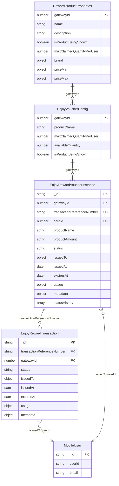

## Business Logic Flow

### **Voucher Lifecycle Diagram**

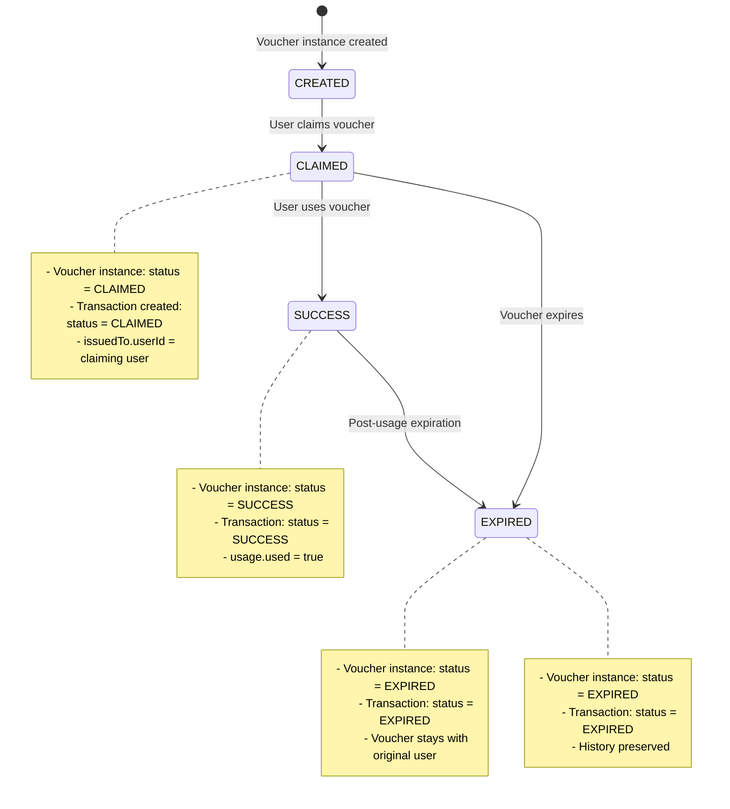

## Entity Responsibilities

### **1. RewardProductProperties (Product Template)**

**Purpose**: Master product template and catalog
**Collection**: `reward.products`

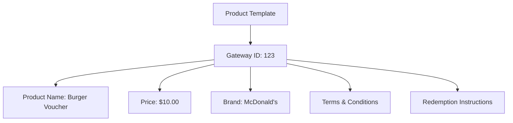

**Key Fields**:
- `gatewayId`: Unique product identifier
- `name`, `description`: Product details
- `brand`: Brand information
- `priceMin`, `priceMax`: Pricing
- `isProductBeingShown`: Visibility flag

### **2. EnjoyVoucherConfig (Backoffice Configuration)**

**Purpose**: Backoffice configuration for product display
**Collection**: `enjoy.voucher.config`

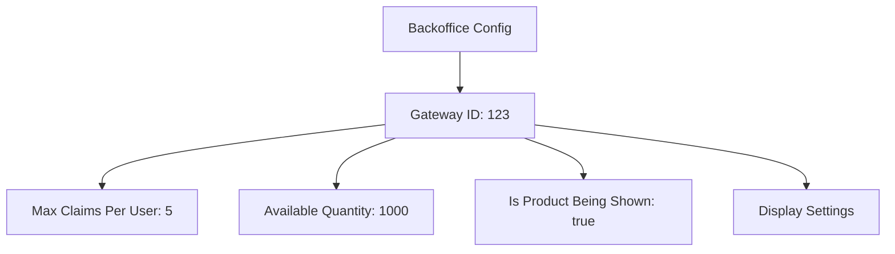

**Key Fields**:
- `gatewayId`: Links to product template
- `maxClaimedQuantityPerUser`: Claim limits
- `availableQuantity`: Available inventory
- `isProductBeingShown`: Display control

### **3. EnjoyRewardVoucherInstance (Physical Voucher)**

**Purpose**: Individual voucher instances that can be assigned to users
**Collection**: `rewards.voucher.instances`

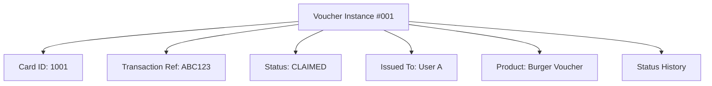

**Key Fields**:
- `cardId`: Unique voucher instance identifier
- `transactionReferenceNumber`: Links to transaction
- `status`: Current voucher state
- `issuedTo`: Current owner
- `statusHistory`: Complete audit trail

### **4. EnjoyRewardTransaction (User's Voucher History)**

**Purpose**: Tracks user's complete voucher transaction history
**Collection**: `reward.transaction`

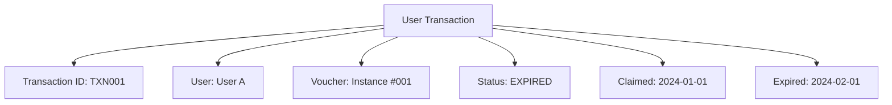

**Key Fields**:
- `transactionReferenceNumber`: Links to voucher instance
- `issuedTo`: User who claimed
- `status`: Transaction status
- `issuedAt`: When claimed
- `expiresAt`: When expires

## Data Flow Diagrams

### **Voucher Claiming Process**

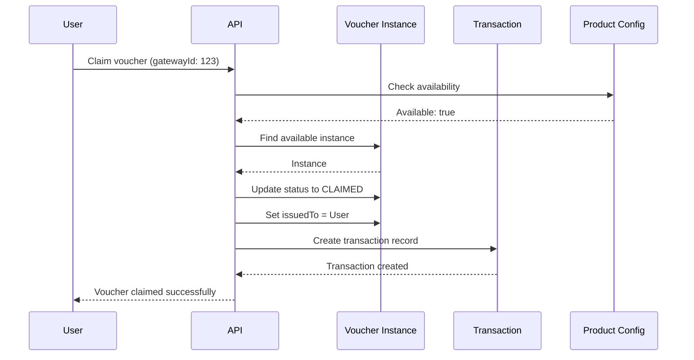

### **Voucher Usage Process**

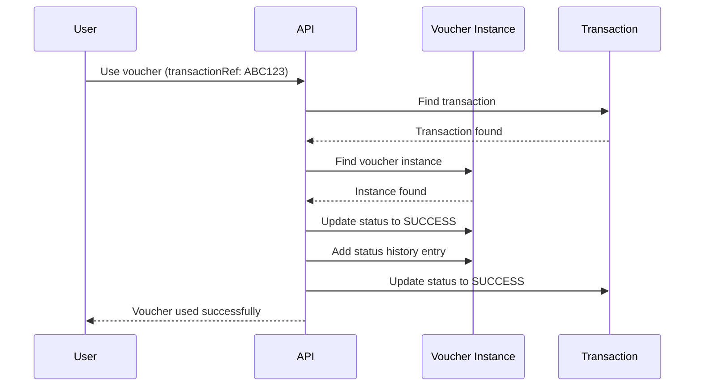

### **Voucher Expiration Process**

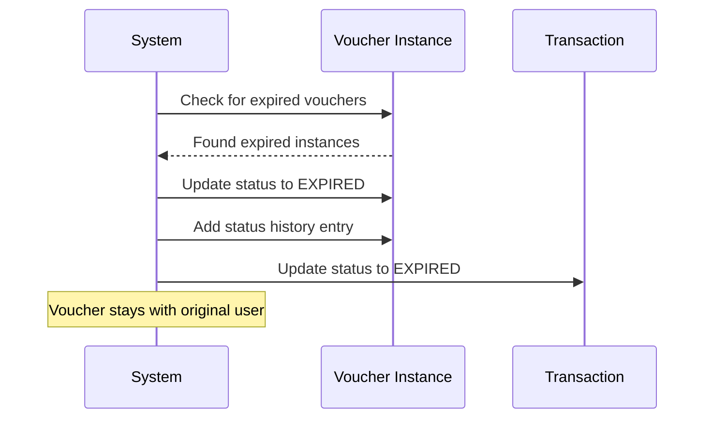

## API Endpoint Mapping

### **Active Vouchers (Voucher Instance)**

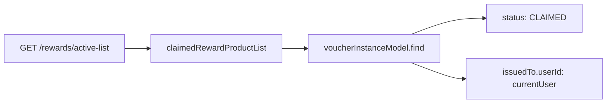

**Purpose**: Show user's currently claimable vouchers
**Data Source**: `voucherInstanceModel`
**Filter**: `status: CLAIMED` + `issuedTo.userId: currentUser`

### **Past Transactions (Transaction Model)**

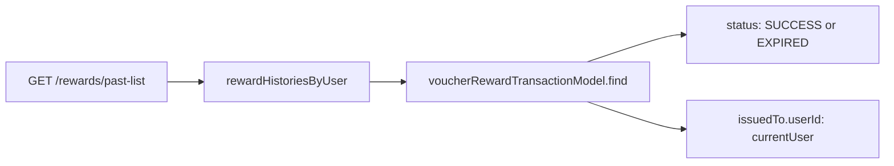

**Purpose**: Show user's complete voucher history
**Data Source**: `voucherRewardTransactionModel`
**Filter**: `status: [SUCCESS, EXPIRED]` + `issuedTo.userId: currentUser`

## Why Both Models Are Needed

### **Business Logic Requirements**

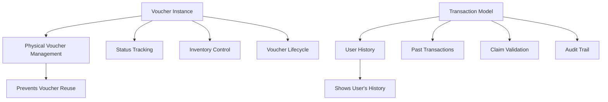

### **Key Differences**

| Aspect | Voucher Instance | Transaction Model |
|--------|------------------|-------------------|
| **Purpose** | Physical voucher management | User's transaction history |
| **Reusability** | ❌ Cannot be reused | ✅ Historical record |
| **Status** | Current voucher state | Transaction status |
| **User Assignment** | Current owner | Original claimant |
| **Data Retention** | Permanent | Permanent |

## Migration Strategy (Updated)

### **Keep Both Models**

**Reason**: Both models serve distinct business purposes and cannot be consolidated without losing critical functionality.

### **Optimization Opportunities**

1. **Status History**: Already implemented in voucher instance
2. **Data Consistency**: Ensure both models stay in sync
3. **Performance**: Optimize queries for each use case
4. **Monitoring**: Track data consistency between models

### **Implementation Plan**

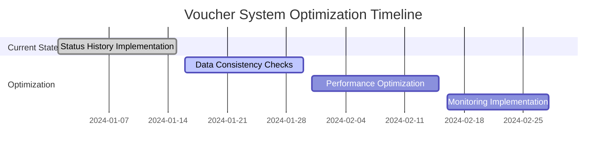

## Conclusion

Both `voucherRewardTransactionModel` and `voucherInstanceModel` are essential components of the voucher system:

- **Voucher Instance**: Manages physical vouchers and prevents reuse
- **Transaction Model**: Tracks user history and provides audit trail

The key is maintaining data consistency between both models while optimizing for their specific use cases.

graph TD
    A[E2E Tests] --> B[Integration Tests]
    B --> C[Unit Tests]
    
    A1[Few E2E Tests] --> A2[Critical User Journeys]
    B1[API Integration Tests] --> B2[Database Integration]
    C1[Service Layer Tests] --> C2[Helper Method Tests]
    
    A1 -.-> A
    B1 -.-> B
    C1 -.-> C